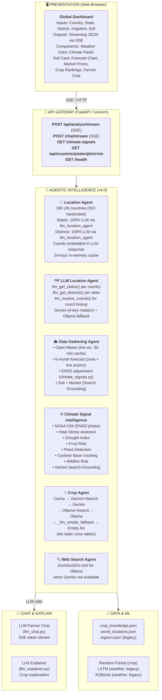

# User Module Paper
## AI Powered Weather Resilient Crop Advisor — v4.0

**Document Type:** User Module Paper  
**Project:** AI Powered Weather Resilient Crop Advisor  
**Version:** 4.0 (Zero Static Data Release)  
**Platform:** Web Application (FastAPI + HTML/CSS/JS + SSE)  
**Repository:** https://github.com/tirthch25/AI-Powered-Weather-Resilient-Crop-Advisor  

---

## Table of Contents

1. [Project Overview](#1-project-overview)
2. [System Architecture](#2-system-architecture)
3. [Agent Modules (v4.0)](#3-agent-modules-v40)
   - 3.1 Location Agent
   - 3.2 LLM Location Agent
   - 3.3 Data Gathering Agent
   - 3.4 Climate Signal Intelligence Service
   - 3.5 Crop Agent
   - 3.6 Web Search Agent
4. [Service Modules](#4-service-modules)
   - 4.1 LLM Chat
   - 4.2 LLM Explainer
   - 4.3 LLM Filter
   - 4.4 Recommender (Legacy v2.x)
   - 4.5 Risk Assessment
   - 4.6 Pest & Disease Warning
   - 4.7 Planting Calendar
5. [API Layer](#5-api-layer)
   - 5.1 Request Models
   - 5.2 All Endpoints
   - 5.3 Streaming Response Protocol
6. [Frontend & UI Engine](#6-frontend--ui-engine)
   - 6.1 Dashboard Structure
   - 6.2 SSE Client
   - 6.3 Climate Intelligence Panel
   - 6.4 Background Soil Enrichment
7. [Data Layer](#7-data-layer)
   - 7.1 World Locations
   - 7.2 Crop Knowledge Database
   - 7.3 Open-Meteo Archive API (replaces Climate Zone Tables)
   - 7.4 LLM-Driven Market Prices (replaces Market Price Templates)
   - 7.5 Legacy Data (v2.x)
8. [Machine Learning Pipeline](#8-machine-learning-pipeline)
9. [LLM Integration Details](#9-llm-integration-details)
10. [Climate Signal Intelligence — Deep Dive](#10-climate-signal-intelligence--deep-dive)
11. [Crop Agent — Deep Dive](#11-crop-agent--deep-dive)
12. [Data Flow Diagram (v4.0)](#12-data-flow-diagram-v40)
13. [Global API Reference](#13-global-api-reference)
14. [Technology Stack & Dependencies](#14-technology-stack--dependencies)
15. [System Limitations & Future Scope](#15-system-limitations--future-scope)

---

## 1. Project Overview

The **AI Powered Weather Resilient Crop Advisor v4.0** is a globally scalable, agentic agricultural advisory web application. It combines live satellite-quality weather data, real-time ENSO climate signals, comprehensive 9-dimensional climate threat assessment, and LLM agents with Google Search Grounding to replicate the advice of an experienced agronomist for any farming region in the world.

### 1.1 Evolution from Prior Versions

| Version | Scope | Key Capability |
|---------|-------|---------------|
| **v2.x** | India-only, 640 districts | Static rule-based engine + basic ML models |
| **v3.0** | Global, 50+ countries | Multi-agent LLM pipeline, Open-Meteo live weather |
| **v3.1** | Global + Climate Intelligence | 9-dimensional climate assessment, Search Grounding, Web Search Agent |
| **v4.0** | Global + Zero Static Data | Open-Meteo Archive API, `_llm_enrich_fast`, background `/api/enrich-soil`, no static fallbacks |

### 1.2 Goals

| Goal | Implementation |
|------|---------------|
| **Global Scale** | Dynamically resolve any global farm location via 195-country ISO list + 100% LLM-driven state and district resolution (24h cache) |
| **Agentic AI** | 6-agent pipeline with specialized roles: Location, LLM-Location, Data, Climate, Crop, Web-Search |
| **Real-Time Context** | Open-Meteo live weather + NOAA ENSO + Gemini Search Grounding for current advisories |
| **Climate Resilience** | 9 climate threat assessors + ENSO-adjusted 6-month forecasts |
| **Conversational UX** | Continuous SSE streaming for analysis + context-aware LLM farmer chat |
| **Graceful Degradation** | 5-tier fallback: Search Grounding → Plain LLM → Ollama → Rule-based → Zone defaults |

---

## 2. System Architecture



---

## 3. Agent Modules (v4.0)

**Location:** `agri_crop_recommendation/src/agents/`

### 3.1 Location Agent (`location_agent.py`)

**Purpose:** Country list and gateway to LLM-driven geographic resolution.

**Architecture:** 100% LLM-driven for states and districts — no static `world_locations.json` lookup in v4.0.

**Coverage:**
- **Countries:** All 195 UN-recognised countries — ISO 3166-1 alpha-2 list hardcoded directly in the agent (`ALL_195_COUNTRIES`). Never stale.
- **States/Provinces:** Always resolved by `llm_location_agent.llm_get_states()` — returns the real, complete list (e.g. all 16 German Bundesländer, all 47 Japanese prefectures, all 36 Nigerian states)
- **Districts:** Always resolved by `llm_location_agent.llm_get_districts()` — any district in any country, including rural and unmapped areas
- **Coordinates:** Embedded in LLM response, or fetched via `llm_resolve_coords()` as a secondary call

**Caching:** States and districts are cached 24 hours in `llm_location_agent._CACHE` so repeated lookups are instant.

**Key Functions:**

| Function | Description |
|----------|-------------|
| `get_countries()` | Returns all 195 countries from hardcoded ISO list |
| `get_states(country_code)` | Calls `llm.llm_get_states()` — full LLM state list, cached 24h |
| `get_districts(country_code, state_code)` | Calls `llm.llm_get_districts()` — full LLM district list |
| `resolve_coordinates(country, state, district)` | Extracts lat/lon from LLM district response |
| `resolve_full(country, state, district)` | Full resolve: lat, lon, climate_zone, crop_notes |

**Fallback Chain:**
1. LLM district list (coords embedded) →
2. `llm_resolve_coords()` dedicated call →
3. State centre coordinates

---

### 3.2 LLM Location Agent (`llm_location_agent.py`)

**Purpose:** Geocodes any global location (including rural, unmapped districts) using LLM inference.

**When It's Called:** Triggered by `location_agent.py` when a district is not found in `world_locations.json`.

**Strategy:**
1. **Gemini** (preferred) — model fallback chain: `gemini-2.5-flash-lite → gemini-2.0-flash-lite → ...`
2. **Ollama** (local fallback) — `llama3.2` or configured model
3. **Geographic estimate** — latitude-based zone estimate as final fallback

**Key Functions:**

| Function | Description |
|----------|-------------|
| `resolve_location_llm(country, state, district)` | Returns `(lat, lon, climate_zone, crop_notes)` via LLM |
| `_call_gemini_location(prompt)` | Tries all 4 Gemini keys with model fallback |
| `_call_ollama_location(prompt)` | Plain Ollama call for geocoding |

**Prompt Strategy:** Asks the LLM to return JSON with `{"lat": float, "lon": float, "climate_zone": str, "crop_notes": str, "region_type": str}`.

**Output Fields:**
- `lat`, `lon` — Decimal coordinates
- `climate_zone` — Tropical/Subtropical/Arid/Temperate/Mediterranean/Continental
- `crop_notes` — Brief note on what crops are grown there
- `region_type` — Rural/Urban/Agricultural

---

### 3.3 Data Gathering Agent (`data_gathering_agent.py`)

**Purpose:** Assembles all real-world data for crop recommendations: live weather, 6-month historical-based forecast, ENSO adjustment, soil data, market prices.

**Version 4.0 changes:** All static zone tables removed. Every data point comes from a live API or LLM.

#### Current Weather Fetching (`_fetch_openmeteo_current`)

**Source:** Open-Meteo Current API (free, no key)  
**URL:** `https://api.open-meteo.com/v1/forecast`  
**Cache:** 30-minute in-memory per `(lat, lon)` rounded to 2 decimal places  

**Fallback (NEW in v4.0):** `_llm_estimate_current_weather(country, lat, lon, month)` — Gemini estimates typical conditions from coordinates when the API is down. No static zone table is used.

**Output fields:**
| Field | Description |
|-------|-------------|
| `temperature_c` | Average of max+min for latest day |
| `temp_max_c` | Maximum temperature |
| `temp_min_c` | Minimum temperature |
| `humidity_pct` | Mean relative humidity |
| `rainfall_7d_mm` | Sum of last 7 days' precipitation |
| `wind_kmh` | Max wind speed |
| `uv_index` | UV index (capped at 11) |
| `feels_like_c` | Heat index approximation |
| `soil_temp_c` | Estimated soil temp (temp_avg − 2°C) |

#### 6-Month Forecast Generation (v4.0)

**Data source priority (no static tables):**

| Priority | Source | Detail |
|----------|--------|--------|
| 1 | **Open-Meteo Archive API** (`_fetch_openmeteo_monthly_climatology`) | Real 2-year historical monthly averages for this exact lat/lon — temperature, rainfall, humidity |
| 2 | **`_llm_generate_forecast()`** | Gemini generates a 6-month forecast from coordinates + country context |
| 3 | **Empty list** | No static zone tables — honest empty state |

**Temperature anchoring:** The live temperature is used to compute an offset (`live_temp − archive_temp_for_current_month`), applied to all 6 forecast months for district-level accuracy.

**Fixed in v4.0:** Forecast now correctly returns **exactly 6 months** (was 7 in v3.x due to `timedelta(days=32*i)` iteration bug).

#### ENSO Adjustment

After building the baseline forecast, `apply_enso_to_forecast()` from `climate_signals.py` adjusts all monthly values. The `climate_signal` dict is now included in the `gathered` return (was missing in v3.x streaming path).

#### LLM Enrichment — Two-Stage (v4.0)

**Stage 1 — Fast (parallel with weather fetch):**  
`_llm_enrich_fast(location_str, country, temp, month)` — single Gemini 2.0 Flash Lite call, targets < 8 seconds. Fires in a `ThreadPoolExecutor` while the weather API call completes. Timeout extended to 20 seconds in the streaming endpoint (was 3s in v3.x — too short).

**Stage 2 — Rich (background, post-render):**  
`/api/enrich-soil` endpoint calls `_llm_enrich()` which tries search-grounded Gemini first. After the dashboard renders, `_bgEnrichSoil()` in `app.js` calls this endpoint and updates the soil card + market prices smoothly.

**What LLM returns:**
```json
{
  "soil": {"type": "Clay-Loam", "ph": 6.5, "organic_matter": "Medium", "drainage": "Good"},
  "market_prices": {"Rice": "₹2,400/quintal", "Wheat": "₹2,100/quintal"},
  "district_summary": "Pune is a major agricultural district...",
  "climate_zone": "Subtropical"
}
```

**If enrichment fails:** Soil shows `type: Unknown, ph: null`. Market prices is `{}`. Frontend shows `🤖 Analyzing...` placeholders. **No static zone-based defaults.**

#### Main Entry Point

```python
def gather_location_data(
    country: str, state: str, district: str,
    lat: float, lon: float,
    month: Optional[int] = None,
    state_code: Optional[str] = None,
) -> dict:
```

**Returns:**
```python
{
    "current": {...},                    # Live weather (null fields if API down)
    "forecast_6month": [...],            # Archive-based 6-month forecast
    "soil": {...},                       # LLM-enriched soil (Unknown if failed)
    "season": "Kharif",                 # LLM-detected season
    "climate_zone": "Subtropical",      # LLM or lat-based zone
    "market_prices": {...},              # Search-grounded or {} if failed
    "district_summary": "...",          # LLM 1-sentence description
    "climate_signal": {...},             # Full ENSO + 9-threat signals
    "location_source": "llm",           # Always "llm" in v4.0
}
```

---

### 3.4 Climate Signal Intelligence Service (`climate_signals.py`)

**Purpose:** Comprehensive 9-dimensional climate threat assessment for any global location.

**Size:** 778 lines — covers all climate threats affecting agriculture.

**Data Sources:**
- NOAA CPC ONI text file (free, fetched every 6 hours)
- Live weather passed from Data Gathering Agent
- Gemini Search Grounding for real-time regional advisories

#### 9 Threat Dimensions

**1. ENSO (El Niño/La Niña)**  
Source: NOAA CPC `oni.ascii.txt`  
Detection: `_oni_to_phase_and_strength(oni: float)`  
Phases: `El Nino` (ONI ≥ 0.5), `El Nino Watch` (0.3–0.5), `Neutral`, `La Nina Watch` (−0.3 to −0.5), `La Nina` (≤ −0.5)  
Strengths: Weak / Moderate / Strong / Developing  

**2. Heat Stress**  
Function: `_assess_heat_stress(current_temp, climate_zone)`  
Zone-specific thresholds: Temperate (30/35/40°C), Tropical (36/41/45°C), Arid (38/43/47°C)  
Levels: Moderate / Severe / Extreme  

**3. Drought Index**  
Function: `_assess_drought(rainfall_7d, climate_zone)`  
Compares 7-day rainfall to zone norm. Deficit >80% → Severe; >50% → Moderate  
Also detects Excess rainfall (>2.5× zone norm → waterlogging alert)  

**4. Frost Risk**  
Function: `_assess_frost(current_temp, climate_zone)`  
Near-Frost: ≤4°C, Frost: ≤0°C  

**5. Flood / Excess Rainfall**  
Detected inside drought assessor when `rainfall_7d > norm × 2.5`  

**6. Cyclone/Typhoon/Hurricane Basin**  
Function: `_get_cyclone_context(location_str, country)`  
7 basins tracked: North Atlantic (Hurricane), Eastern Pacific (Hurricane), Western Pacific (Typhoon), North Indian Bay of Bengal (Cyclone), North Indian Arabian Sea (Cyclone), South Indian Ocean (Cyclone), South Pacific (Cyclone/Typhoon)  
Active season detection per basin.  

**7. Wildfire Risk**  
Function: `_assess_wildfire(current_temp, rainfall_7d, climate_zone)`  
High-risk zones: Mediterranean, Arid, Temperate_Americas, Subtropical_S, Arid_Oceania  
Triggered when: `temp ≥ 35°C AND rainfall_7d < 5mm` (High) or `temp ≥ 30°C AND rainfall_7d < 10mm` (Moderate)  

**8. Soil Moisture Stress**  
Inferred from drought/excess rainfall assessors.  

**9. Climate Change Trend**  
Gemini Search Grounding retrieves current regional climate advisories and long-term trend data.  

#### ENSO Zone Impact Table (`_ENSO_IMPACTS`)

```python
_ENSO_IMPACTS = {
    "El Nino": {
        "India":          (-0.20, +0.5),   # rainfall factor, temp offset
        "Subtropical":    (-0.15, +0.4),
        "Tropical":       (-0.10, +0.3),
        "China":          (+0.25, +0.8),   # China GETS more rain in El Nino
        "Southeast_Asia": (-0.10, +0.5),
        "Arid_Oceania":   (-0.20, +1.0),   # Severe drought in Australia
        ...
    },
    "La Nina": { ... },
    "El Nino Watch": { ... },  # ~50% of El Nino impact
    "La Nina Watch": { ... },
    "Neutral": {},             # No adjustments
}
```

#### Country → ENSO Zone Key Mapping (`_COUNTRY_TO_ZONE_KEY`)

```python
{
    "china":       "South_China",
    "japan":       "East_Asia",
    "south korea": "East_Asia",
    "thailand":    "Southeast_Asia",
    "indonesia":   "Southeast_Asia",
    "india":       "India",
    "australia":   "Arid_Oceania",
}
```

**South China Regions:** Guangdong, Guangxi, Hainan, Fujian, Hong Kong, Macau → automatically mapped to `South_China` zone key regardless of country name.

#### Gemini Search-Grounded Climate Analysis

The function `_gemini_comprehensive_climate()` sends a structured prompt requesting:
1. Current drought index or rainfall anomaly
2. Active heat waves, cold snaps, extreme weather
3. Government crop advisories or agricultural warnings
4. Climate change trends affecting agriculture
5. Active pest/disease outbreaks linked to climate

Returns JSON with: `summary`, `enso_impact`, `heat_stress_risk`, `drought_risk`, `flood_risk`, `frost_risk`, `cyclone_risk`, `wildfire_risk`, `climate_change_trend`, `crop_risks[]`, `immediate_actions[]`, `seasonal_outlook`, `alert_level`, `rainfall_outlook`, `temp_outlook`.

#### Caching

- **Cache key:** `(zone_key, country_lc, round(current_temp), round(rainfall_7d))`
- **TTL:** 6 hours — ENSO data updates monthly, but Search Grounding is real-time

#### Forecast Adjustment

```python
def apply_enso_to_forecast(forecast_6month: list, climate_signals: dict) -> list:
    # Applies rainfall_factor and temp_offset_c to all 7 forecast months
    m["rainfall_mm"] = m["rainfall_mm"] * rainfall_factor
    m["temp_avg"]    = m["temp_avg"] + temp_offset_c
    m["temp_max"]    = m["temp_max"] + temp_offset_c
    m["temp_min"]    = m["temp_min"] + temp_offset_c
    m["soil_temp_c"] = m["soil_temp_c"] + temp_offset_c
    m["enso_adjusted"] = True
```

---

### 3.5 Crop Agent (`crop_agent.py`)

**Purpose:** AI-powered crop ranking for any global location.

**Version 4.0 changes:** All static fallback tables removed. Country-specific crop hint lists removed. Geographic validation simplified.

#### Pipeline (in priority order)

| Priority | Method | Description |
|----------|--------|-------------|
| 1 | **In-memory cache** | Returns instantly if same `(country, state, district, season, climate, irrigation)` was requested within 1 hour |
| 2 | **Ollama + Web Search Tool** | Local LLM (llama3.2) with DuckDuckGo tool-calling — primary provider |
| 3 | **Ollama plain** | Local LLM, no search |
| 4 | **Gemini + Google Search Grounding** | Real-time crop advisories, current pest alerts, live market info |
| 5 | **Gemini plain** (4-key rotation, model chain) | LLM knowledge with full location-aware prompt |
| 6 | **`_llm_simple_fallback()`** | Minimal single-shot Gemini/Ollama prompt — last resort |
| 7 | **Empty list** | Honest empty state — **no static crop tables** |

#### Prompt Structure (`_build_prompt`)

The LLM prompt includes:
- Country, state, district, season, climate zone, hemisphere (Northern/Southern)
- Live weather: temperature, humidity, 7-day rainfall
- 3-month forecast summary
- Soil type, pH, organic matter, drainage
- Local market prices (from LLM enrichment)
- District summary (1 sentence)
- Irrigation level and planning days

**Requested output:** JSON array of 6 crops with fields:
`crop_name`, `local_name`, `suitability_score` (0-100), `season_fit`, `risk_level`, `duration_days`, `water_need`, `estimated_yield`, `planting_window`, `market_demand`, `reasons[]`, `warnings[]`, `growing_tip`

#### Geographic Validation (`_validate_crops`)

In v4.0, validation is simplified — prompts include explicit regional context so hallucination is less likely. The validation layer checks structural correctness (required fields, score ranges) rather than geographic filtering.

#### Simple Fallback (`_llm_simple_fallback`)

When all providers fail, a minimal Gemini prompt asks for 3 crops appropriate for the coordinates and month. If this also fails, returns `[]` — no static table.

#### Caching

- **Cache key:** `(country, state, district, season, climate, irrigation)`
- **TTL:** 1 hour (configurable via `_CROP_CACHE_TTL`)

---

### 3.6 Web Search Agent (`web_search_agent.py`)

**Purpose:** Enables Ollama to perform web searches via DuckDuckGo tool-calling.

**When Used:** Called by `crop_agent.py` (step 4 of pipeline) and `data_gathering_agent.py` when Gemini is not configured.

**Mechanism:**
1. Defines a `web_search` tool schema for Ollama's tool-calling API
2. Sends the prompt with available tools to Ollama
3. When Ollama calls the tool, executes DuckDuckGo search
4. Returns search results back to Ollama for final response

**Key Function:**
```python
def call_ollama_with_search(prompt: str, location: str = "", timeout: int = 45) -> Optional[str]:
```

---

## 4. Service Modules

**Location:** `agri_crop_recommendation/src/services/`

### 4.1 LLM Farmer Chat (`llm_chat.py`)

**Purpose:** Context-aware AI farming Q&A with real-time token streaming.

**Features:**
- **Context injection:** Farm-specific data (location, weather, ENSO phase, crop recommendations) is prepended to every LLM prompt
- **SSE streaming:** Tokens streamed character-by-character via FastAPI `StreamingResponse`
- **Multi-provider:** Tries Gemini (with key rotation) first, then Ollama

**Input context fields:**
```python
{
    "country": str, "state": str, "district": str,
    "weather": dict,           # live weather
    "soil": dict,              # soil data
    "enso_phase": str,         # El Nino/La Nina/Neutral
    "crop_recommendations": list,  # top crops from crop agent
    "season": str,
    "climate_zone": str,
}
```

### 4.2 LLM Explainer (`llm_explainer.py`)

**Purpose:** Generates short, farmer-friendly natural language explanations for why each top crop was recommended.

**Output includes:**
- Why this crop suits the specific climate and soil
- Key risk warnings (optionally multilingual)
- Best practices for the region

### 4.3 LLM Filter (`llm_filter.py`)

**Purpose:** Pre-filters the crop knowledge database to candidate crops before passing to the Crop Agent, reducing prompt length and improving LLM accuracy.

### 4.4 Recommender Engine (`recommender.py`)

**Purpose:** Legacy v2.x rule-based crop recommendation engine. Used by the `/recommend` endpoint.

**Scoring Formula:**

| Factor | Weight | Computation |
|--------|--------|-------------|
| Temperature Compatibility | 25% | Optimal range = 100; decay curve to survival limits; hard cutoff beyond limits |
| Water Availability | 25% | Expected rainfall + irrigation vs. crop water requirement; ENSO-adjusted |
| Soil Compatibility | 15% | Texture, pH, drainage, organic matter matching |
| Regional Suitability | 15% | District-specific modifiers from regions.json |
| Seasonal Adjustment | 10% | Traditional planting season match |
| Drought Tolerance Bonus | 10% | Score boost during El Niño dry spells |

**ML Blend:** If Random Forest model is loaded, final score = `0.6 × ML_score + 0.4 × rule_score`.

### 4.5 Risk Assessment Engine (`risk.py`)

**Purpose:** Rule-based drought and temperature stress assessment. Still used in legacy `/recommend` pipeline.

**Checks:**
- Soil moisture deficit
- Temperature range stress for each crop
- Combined drought + heat stress scenarios

### 4.6 Pest & Disease Warning System (`pests.py`)

**Purpose:** Rule-based pest and disease alerts based on weather thresholds.

**Examples:**
- High humidity + high temperature → Fungal disease pressure
- Low rainfall + hot temperatures → Aphid/mite risk
- Post-rain warm periods → Late blight in potatoes

### 4.7 Planting Calendar (`calendar.py`)

**Purpose:** Generates rule-based growth phase timelines for recommended crops.

**Phases:** Soil Preparation → Sowing → Germination → Vegetative → Flowering → Maturity → Harvest

---

## 5. API Layer

**Location:** `agri_crop_recommendation/src/api/`

### 5.1 Request Models (`models.py`)

**`AnalyzeRequest`** (POST `/api/analyze/stream`):
```python
class AnalyzeRequest(BaseModel):
    country:     str
    state:       str
    district:    str
    irrigation:  str = "Limited"          # None / Limited / Full
    planning_days: int = 90               # 30 / 60 / 90 / 180
    soil_type:   Optional[str] = None     # Clay / Loam / Sandy / etc.
    soil_ph:     Optional[float] = None   # 4.5 – 8.5
    month:       Optional[int] = None     # 1–12 (defaults to current month)
```

**`ChatRequest`** (POST `/chat` and `/chat/stream`):
```python
class ChatRequest(BaseModel):
    message: str
    context: Optional[dict] = None  # weather, soil, crops, ENSO, etc.
    history: Optional[list] = None  # previous chat turns
```

### 5.2 All Endpoints (`app.py`)

| Method | Endpoint | Auth | Description |
|--------|----------|------|-------------|
| `GET` | `/` | None | Serves the HTML dashboard |
| `GET` | `/api/countries` | None | Returns sorted country list (195 countries) |
| `GET` | `/api/states/{country}` | None | Returns states for a country (LLM-generated) |
| `GET` | `/api/districts/{country}/{state}` | None | Returns districts for a state (LLM-generated) |
| `POST` | `/api/analyze/stream` | None | **Main SSE streaming analysis** (5-step pipeline) |
| `GET` | `/api/enrich-soil` | None | **Background soil enrichment** — search-grounded Gemini |
| `GET` | `/climate-signals` | None | 9-dimensional climate assessment + ENSO |
| `POST` | `/chat` | None | Single-turn farmer chat |
| `POST` | `/chat/stream` | None | Streaming farmer chat (SSE) |
| `GET` | `/weather/now/{region_id}` | None | Live temperature from Open-Meteo |
| `POST` | `/recommend` | None | Legacy batch JSON recommendation (v2.x) |
| `GET` | `/health` | None | System health, version, LLM provider info |
| `GET` | `/docs` | None | Auto-generated Swagger UI |
| `GET` | `/redoc` | None | ReDoc API documentation |

### 5.3 Streaming Response Protocol

The `/api/analyze/stream` endpoint uses **Server-Sent Events (SSE)** to stream progress and results:

**SSE Event Format:**
```
data: {"type": "progress", "step": "weather", "message": "Fetching live weather..."}

data: {"type": "weather", "data": {"temperature_c": 32.4, "humidity_pct": 68, ...}}

data: {"type": "climate_signals", "data": {"enso_phase": "Neutral", "threats": {...}, ...}}

data: {"type": "soil", "data": {"type": "Clay-Loam", "ph": 6.5, ...}}

data: {"type": "market", "data": {"Wheat": "₹2,400/quintal", ...}}

data: {"type": "forecast", "data": [{"month": "Jul 2026", "temp_avg": 28, ...}, ...]}

data: {"type": "crops", "data": [{"crop_name": "Rice", "suitability_score": 88, ...}, ...]}

data: {"type": "summary", "data": "Based on the current El Niño conditions..."}

data: {"type": "done"}
```

**Client-side handling** (`app.js`):
```javascript
const evtSource = new EventSource('/api/analyze/stream', {method: 'POST', body: ...});
evtSource.onmessage = (event) => {
    const payload = JSON.parse(event.data);
    if (payload.type === 'crops') renderCropCards(payload.data);
    if (payload.type === 'climate_signals') renderClimatePanel(payload.data);
    // etc.
};
```

---

## 6. Frontend & UI Engine

**Location:** `agri_crop_recommendation/templates/index.html`, `static/js/app.js`, `static/css/style.css`

### 6.1 Dashboard Structure

```
┌─────────────────────────────────────────────────────┐
│  🌾 AI Crop Advisor     [Country] [State] [District] │
│  Irrigation: [None/Limited/Full]  Days: [30/60/90]   │
│  Soil: [type] pH: [value]   [Analyze with AI Agent]  │
├─────────────────────────────────────────────────────┤
│  Progress Strip (SSE progress events)                │
├─────────────────────────────────────────────────────┤
│  ┌──────────────┐  ┌──────────────┐                 │
│  │ 🌡️ Weather   │  │ 🏔️ Soil      │                 │
│  │ Temp, Rain   │  │ Type, pH     │                 │
│  │ Wind, UV     │  │ Drainage     │                 │
│  └──────────────┘  └──────────────┘                 │
├─────────────────────────────────────────────────────┤
│  🌐 Climate Intelligence Panel                       │
│  ENSO Badge + ONI | Threat Cards | Alert Level       │
│  AI Summary | Rainfall/Temp Outlook | Actions        │
├─────────────────────────────────────────────────────┤
│  📈 6-Month Forecast Chart (Chart.js — dual axis)    │
│  Temperature curve + Rainfall bars (ENSO-adjusted)   │
├─────────────────────────────────────────────────────┤
│  💰 Market Prices Card                               │
├─────────────────────────────────────────────────────┤
│  🌱 Crop Rankings (6 cards, sorted by suitability)   │
│  Each card: Score, Risk, Season Fit, Duration,       │
│  Water Need, Yield, Planting Window, Reasons         │
├─────────────────────────────────────────────────────┤
│  💬 AI Farmer Chat (SSE streaming Q&A)               │
└─────────────────────────────────────────────────────┘
```

### 6.2 SSE Client (`app.js`)

**Key Functions:**

| Function | Description |
|----------|-------------|
| `loadCountries()` | Populates country dropdown on page load |
| `loadStates(country)` | Cascading state dropdown |
| `loadDistricts(country, state)` | Cascading district dropdown |
| `startAnalysis()` | Initiates SSE stream on form submit |
| `renderWeatherCard(data)` | Builds live weather display |
| `renderClimatePanel(data)` | Builds 9-threat Climate Intelligence Panel |
| `renderForecastChart(data)` | Renders Chart.js dual-axis chart |
| `renderCropCards(crops)` | Generates suitability score cards |
| `sendChatMessage()` | Initiates SSE chat stream |

### 6.3 Climate Intelligence Panel (`renderClimatePanel`)

The Climate Intelligence Panel is rendered dynamically from the `climate_signals` SSE event or the `gathered.climate_signal` dict in the final `done` event. It shows ENSO badge, threat tiles, alert bar, AI summary, rainfall/temp outlook, crop risks, immediate actions, and forecast adjustment description.

### 6.4 Background Soil Enrichment

After `renderDashboard()` renders the initial result, `_bgEnrichSoil(loc, current, gathered)` fires automatically:

```javascript
async function _bgEnrichSoil(loc, current, gathered) {
    // Calls GET /api/enrich-soil?district=...&state=...&country=...&temp=...&month=...
    // On success, calls _updateSoilCard(soil, market, summary)
    // _updateSoilCard() only updates cells still showing '🤖 Analyzing...'
    // Updates animate with fadeIn CSS transition
}
```

This ensures:
1. **Fast first render** — `_llm_enrich_fast()` data shown immediately (soil may be `Unknown` if LLM was slow)
2. **Rich update** — Search-grounded Gemini data arrives 10-20s later and updates the soil card smoothly
3. **No re-render** — Only the specific soil/market cells that need updating are changed

---

## 7. Data Layer

### 7.1 World Locations (`data/reference/world_locations.json`)

**Coverage:** Legacy reference file — 50+ countries, 250+ states, 170+ districts  
**Usage in v4.0:** Not used for primary resolution. All states and districts are resolved by `llm_location_agent.py` via Gemini/Ollama.

### 7.2 Crop Knowledge Database (`data/reference/crop_knowledge.json`)

**Purpose:** LLM context for `llm_filter.py` and legacy rule-based scoring  
**Contents:** 50+ crops with temperature ranges, water requirements, soil types, growing seasons, durations, regional modifiers, pest/disease info.

### 7.3 Open-Meteo Archive API (replaces Climate Zone Tables)

**v4.0 change:** The static `_ZONE_CLIMATE` dict (120 cells of approximated monthly data) has been replaced by the **Open-Meteo Archive API**.

**API:** `https://archive-api.open-meteo.com/v1/archive`  
**Data:** 2 years of daily historical data (`temperature_2m_max`, `temperature_2m_min`, `precipitation_sum`, `relative_humidity_2m_mean`)  
**Aggregation:** Averaged per calendar month across both years to produce 12 monthly data points per lat/lon  
**Cache:** 30-minute in-memory cache per `(lat, lon)` key

This provides **real per-district climate data** rather than zone-wide approximations. A location in coastal Maharashtra gets different values from an inland Maharashtra location — something the old zone tables could never provide.

### 7.4 LLM-Driven Market Prices (replaces Market Price Templates)

**v4.0 change:** `_ZONE_MARKET_TEMPLATES` and `_COUNTRY_CURRENCY` removed. Market prices now come exclusively from:
1. **Gemini Search Grounding** — searches for current local crop prices in local currency
2. **Plain Gemini** — uses training knowledge of typical crop prices for the region
3. **`{}`** — empty dict if both fail (no template-based fake prices)

### 7.5 Legacy Data (v2.x)

| File | Description |
|------|-------------|
| `data/reference/regions.json` | India 640-district database with state code mapping |
| `data/reference/regional_crops.json` | India regional crop catalog |
| `src/weather/history.py` | India zone-based historical climate data (monthly averages) |

---

## 8. Machine Learning Pipeline

### 8.1 Random Forest Suitability Model

**File:** `src/ml/predictor.py`  
**Library:** scikit-learn 1.8.0  
**Type:** Random Forest Regressor  
**Training:** `scripts/train_model.py` on simulated crop suitability data  
**Saved to:** `models/crop_suitability/`

**Features used:**
- Temperature (avg, max, min)
- Rainfall (monthly)
- Humidity
- Soil type (encoded)
- Soil pH
- Season (encoded)
- Crop type (encoded)

**Score blending (when loaded):**
```
final_score = 0.6 × ML_score + 0.4 × rule_based_score
```

### 8.2 LSTM Weather Forecasting (Legacy)

**File:** `src/ml/lstm_weather.py`  
**Library:** PyTorch 2.9.0  
**Purpose:** Medium-range weather forecasting from historical Parquet data  
**Status:** Superseded by Open-Meteo live data + zone climatology in v3.0+  
**Saved to:** `models/weather_lstm/`

### 8.3 XGBoost Weather Model (Legacy)

**Library:** XGBoost 3.2.0  
**Purpose:** Alternative weather forecasting  
**Status:** Maintained for backward compatibility  
**Saved to:** `models/weather_xgboost/`

---

## 9. LLM Integration Details

### 9.1 Provider Priority Chain

All 3 LLM-using agents follow the same priority chain:

```
1. Ollama + DuckDuckGo Web Search Tool
   → Local model with web search (primary; free, private)
2. Ollama plain
   → Local model, fully offline
3. Gemini + Google Search Grounding (search-capable models)
   → Real-time data from the live web
4. Gemini plain (all models, 4-key rotation)
   → Static LLM knowledge
5. _llm_simple_fallback() — minimal stripped-down prompt
   → Last-chance attempt before returning empty result
6. Empty result (honest empty state — no static zone defaults)
```

### 9.2 Gemini Key Rotation

```python
GEMINI_KEYS: list = [k for k in [
    os.getenv("GEMINI_API_KEY", ""),
    os.getenv("GEMINI_API_KEY_2", ""),
    os.getenv("GEMINI_API_KEY_3", ""),
    os.getenv("GEMINI_API_KEY_4", ""),
] if k.strip()]

# On 429 RESOURCE_EXHAUSTED: rotate to next key
for api_key in GEMINI_KEYS:
    for model in _GEMINI_MODELS:
        try: ...
        except Exception as e:
            if "429" in str(e): continue  # try next key/model
```

### 9.3 Google Search Grounding

Enabled via `google-genai` SDK:

```python
from google.genai import types as _gt

resp = client.models.generate_content(
    model="gemini-2.0-flash",
    contents=prompt,
    config=_gt.GenerateContentConfig(
        tools=[_gt.Tool(google_search=_gt.GoogleSearch())],
    ),
)
```

**Supported models:** `gemini-2.0-flash`, `gemini-2.5-flash`, `gemini-2.0-flash-001`

### 9.4 Model Fallback Chain

```python
_GEMINI_MODELS = [
    "gemini-2.5-flash-lite",      # Fastest, most cost-efficient
    "gemini-2.0-flash-lite",      # Good balance
    "gemini-2.0-flash-lite-001",  # Stable snapshot
    "gemini-flash-lite-latest",   # Latest lite
    "gemini-2.0-flash",           # Full capability
    "gemini-2.5-flash",           # Most capable
]

_SEARCH_MODELS = [
    "gemini-2.0-flash",
    "gemini-2.5-flash",
    "gemini-2.0-flash-001",
]
```

### 9.5 In-Memory Caching

| Cache | Key Fields | TTL |
|-------|-----------|-----|
| Weather | `(lat, lon)` rounded to 2dp | 30 minutes |
| Climate Signals | `(zone, country, temp, rainfall)` | 6 hours |
| Crop Recommendations | `(country, state, district, season, climate, irrigation)` | 1 hour |

---

## 10. Climate Signal Intelligence — Deep Dive

_(See Section 3.4 for detailed coverage. Key formulas repeated here for reference.)_

### 10.4 Forecast Adjustment Formula

```
adjusted_rainfall_mm[month] = baseline_rainfall_mm[month] × (1 + rain_factor)
adjusted_temp_avg[month]    = baseline_temp_avg[month] + temp_offset_c

Examples:
  El Niño in India:          rain_factor=-0.20, temp_offset=+0.5
  La Niña in India:          rain_factor=+0.20, temp_offset=-0.3
  El Niño in South China:    rain_factor=+0.25, temp_offset=+0.8  (typhoon risk)
  El Niño in Arid Oceania:   rain_factor=-0.20, temp_offset=+1.0  (severe drought)
```

---

## 11. Crop Agent — Deep Dive

_(See Section 3.5 for detailed coverage.)_

### 11.3 All-LLM-Fail Behaviour (v4.0)

In v4.0, **all static fallback zone crop tables have been removed**. There is no `_fallback_crops()` function.

When every LLM provider fails (Ollama unavailable + Gemini quota exhausted + `_llm_simple_fallback()` also fails), the agent returns an **empty list** `[]`.

The UI displays a clear message asking the user to check their LLM configuration or try again later. This is intentional: serving fake, hardcoded crop data is considered worse than an honest empty state.

| Scenario | v3.x Behaviour | v4.0 Behaviour |
|----------|---------------|----------------|
| All LLMs fail | Returns static zone table (600+ lines) | Returns `[]` — honest empty list |
| Partial failure | May mix static + LLM data | Pure LLM or nothing |
| No Gemini key | Falls back to zone table | Falls back to Ollama, then `[]` |

---

## 12. Data Flow Diagram (v4.0)

```
FARMER INPUT (Web Form: Country, State, District, Irrigation, Soil, Days)
        │
        ▼
POST /api/analyze/stream (FastAPI SSE endpoint)
        │
        ├──[1]── Location Agent (location_agent.py)
        │        → 195 UN-recognised countries (ISO hardcoded list)
        │        → LLM Location Agent (llm_location_agent.py) — 100% LLM state/district
        │        → Returns: lat, lon, state_code (coords embedded in LLM response)
        │        → 24-hour in-memory cache per country/state
        │
        ├──[2]── PARALLEL: Weather Fetch + AI Enrichment
        │        Thread A: Open-Meteo Current API → live weather (30-min cache)
        │        │         Fallback: _llm_estimate_current_weather() → LLM estimate
        │        Thread B: _llm_enrich_fast() → Gemini 2.0 Flash Lite (~5-8s)
        │                  → soil type, pH, drainage, market prices (parallel)
        │
        ├──[3]── 6-Month Forecast (Open-Meteo Archive API)
        │        ├─ Real 2-year historical monthly averages per lat/lon (NO zone tables)
        │        ├─ Anchored to live temperature offset
        │        ├─ Climate Signals (climate_signals.py)
        │        │   ├─ NOAA CPC ONI → ENSO phase (fetched every 6h)
        │        │   ├─ 9 local threat assessors (heat, drought, frost, flood,
        │        │   │   cyclone, wildfire, soil moisture, ENSO, climate change)
        │        │   └─ Gemini Search Grounding → regional advisories
        │        └─ apply_enso_to_forecast() → ENSO-adjusted 6-month forecast
        │
        ├──[4]── Collect AI Enrichment (timeout: 20s)
        │        → Soil + Market data from Thread B (_llm_enrich_fast)
        │        → If fast enrichment fails: shows 🤖 Analyzing... (no zone defaults)
        │
        ├──[5]── Crop Agent (crop_agent.py)
        │        ├─ In-memory cache (1h)
        │        ├─ Gemini + Google Search Grounding → real-time advisories
        │        ├─ Gemini plain (4 keys × 6 models)
        │        ├─ Ollama + DuckDuckGo Web Search (web_search_agent.py)
        │        ├─ Ollama plain
        │        ├─ _llm_simple_fallback() → minimal Gemini call
        │        └─ Empty list (NO static zone crop tables)
        │
        ├──[6]── Stream Output (FastAPI StreamingResponse)
        │        ▼ SSE events:
        │        step1 (location) → step2 (weather) → step3 (forecast)
        │        → step4 (soil+market) → step5 (crops) → done (full JSON)
        │
        └──[BACKGROUND]── GET /api/enrich-soil (fires after dashboard renders)
                 → _llm_enrich() — search-grounded Gemini enrichment
                 → _updateSoilCard() — smooth fadeIn update in UI
                 │
                 ▼
        REAL-TIME STREAMING DASHBOARD (app.js)
        Renders: Weather Card, Climate Panel, Forecast Chart,
                 Market Card, Crop Rankings
        Background: Soil card updates smoothly via _bgEnrichSoil()
```

---

## 13. Global API Reference

### Location APIs

```http
GET /api/countries
→ ["Australia", "Brazil", "Canada", "China", "Germany", "India", ...]

GET /api/states/india
→ ["Andhra Pradesh", "Bihar", "Gujarat", "Maharashtra", "Punjab", ...]

GET /api/districts/india/maharashtra
→ ["Ahmednagar", "Aurangabad", "Nagpur", "Nashik", "Pune", "Solapur", ...]
```

### Core Analysis API

```http
POST /api/analyze/stream
Content-Type: application/json

{
  "country": "India",
  "state": "Maharashtra",
  "district": "Pune",
  "irrigation": "Limited",
  "planning_days": 90,
  "soil_type": "Loam",
  "soil_ph": 6.8,
  "month": 6
}

→ SSE stream (see Section 5.3 for event format)
```

### Climate Signals API

```http
GET /climate-signals?country=india&state=Maharashtra&district=Pune&climate_zone=Subtropical

→ {
    "climate_signals": {
      "enso_phase": "Neutral",
      "enso_strength": "Neutral",
      "oni_value": 0.12,
      "phase_label": "Neutral (Normal)",
      "threats": {
        "heat_stress": null,
        "drought": null,
        "frost": null,
        "wildfire": null,
        "cyclone": {"storm_type": "Cyclone", "in_active_season": false, ...}
      },
      "ai_interpretation": {
        "summary": "...",
        "crop_risks": ["...", "...", "..."],
        "immediate_actions": ["...", "..."],
        "alert_level": "None",
        "rainfall_outlook": "Near Normal",
        "temp_outlook": "Near Normal"
      },
      "forecast_adjustments": {
        "rainfall_factor": 1.0,
        "temp_offset_c": 0.0,
        "description": "No ENSO adjustment (Neutral conditions)"
      },
      "fetched_at": "2026-06-16T13:40:00",
      "source": "NOAA CPC + Gemini Search Grounding + Live Weather",
      "data_freshness": "ENSO: monthly; live threats: real-time"
    }
  }
```

### Farmer Chat API

```http
POST /chat/stream
Content-Type: application/json

{
  "message": "How does the current El Niño affect my wheat crop?",
  "context": {
    "country": "India",
    "state": "Maharashtra",
    "district": "Pune",
    "enso_phase": "El Nino",
    "weather": {...},
    "crop_recommendations": [...]
  }
}

→ SSE stream of LLM tokens (text/event-stream)
```

### Health Check

```http
GET /health

→ {
    "status": "healthy",
    "version": "4.0",
    "regions_loaded": true,
    "ml_models": {"crop_suitability": true, "weather_lstm": false, "xgboost": false},
    "llm_available": true,
    "llm_provider": "ollama",
    "ollama_running": true,
    "ollama_model": "llama3.2",
    "gemini_keys": 2,
    "timestamp": "2026-06-16T13:40:00"
  }
```

---

## 14. Technology Stack & Dependencies

| Category | Technology | Version | Purpose |
|----------|-----------|---------|---------|
| **Backend Framework** | FastAPI | 0.128.7 | High-performance async API + SSE streaming |
| **ASGI Server** | Uvicorn | 0.40.0 | Production-grade ASGI server |
| **Primary Local LLM** | Ollama | 0.6.2 | LLaMA 3.2 / Gemma local inference |
| **Cloud LLM** | Google Gemini | via google-genai 1.69 | Search Grounding + cloud fallback |
| **HTTP Client** | requests | 2.32.5 | Open-Meteo + NOAA API calls |
| **ML — Suitability** | scikit-learn | 1.8.0 | Random Forest crop regressor |
| **ML — Weather (LSTM)** | PyTorch | 2.9.0 | LSTM sequence model |
| **ML — Weather (XGBoost)** | XGBoost | 3.2.0 | Gradient boosting weather model |
| **ML — Jobs** | joblib | 1.5.3 | Model serialization |
| **Data Processing** | pandas | 2.3.3 | DataFrame operations |
| **Data Processing** | numpy | 2.3.5 | Numerical computing |
| **Parquet I/O** | pyarrow | 22.0.0 | Legacy Parquet data files |
| **Visualization** | matplotlib | 3.10.8 | Backend charts (legacy) |
| **Visualization** | seaborn | 0.13.2 | Statistical visualization (legacy) |
| **HTML Templating** | Jinja2 | 3.1.6 | Server-side HTML rendering |
| **Multipart Forms** | python-multipart | 0.0.22 | File upload handling |
| **Environment** | python-dotenv | 1.2.1 | .env file loading |
| **Frontend Charting** | Chart.js | (CDN) | Temperature/rainfall dual-axis chart |
| **Streaming Protocol** | Server-Sent Events | (native) | Real-time text generation to UI |

---

## 15. System Limitations & Future Scope

### 15.1 Current Limitations

| Limitation | Description |
|-----------|-------------|
| **Weather API Dependency** | Requires internet for Open-Meteo live weather. Graceful fallback to zone estimates exists. |
| **Crop Coverage** | Primarily covers annual crops (15–270 days). Long-cycle perennials (e.g., timber, rubber plantations) have limited detail. |
| **Soil Testing** | Relies on LLM-deduced or zone-default soil profiles. No integration with real IoT soil sensors. |
| **Market Prices** | Search-grounded prices are best-effort. Wholesale commodity exchange APIs not integrated. |
| **District Coverage** | world_locations.json covers ~170 districts explicitly. Rural districts fall back to LLM geocoding. |
| **Language** | UI is English-only. LLM warnings can be requested in other languages via chat. |
| **NOAA Dependency** | ENSO data unavailable if NOAA CPC is unreachable (firewall/outage). Falls back to Neutral. |

### 15.2 Future Scope

| Feature | Description |
|---------|-------------|
| **RAG Farmer Chat** | Index `crop_knowledge.json` into ChromaDB/FAISS vector store for retrieval-augmented, strictly grounded Q&A |
| **Live Market APIs** | AgMarkNet (India), USDA NASS (USA), CME Group commodity prices integration |
| **Farmer Profiles** | Persistent user accounts to track crop cycles, seasonal history, and personalized recommendations |
| **Multi-Language UI** | Hindi, Tamil, Telugu, Marathi, Swahili, Spanish, French interfaces |
| **Mobile App** | React Native or Flutter app with offline-capable rule engine |
| **Satellite NDVI** | NASA/ESA satellite vegetation index integration for crop health monitoring |
| **IoT Sensor Integration** | Real soil NPK, moisture, EC sensor data from Raspberry Pi / Arduino nodes |
| **Blockchain Traceability** | On-chain crop provenance for premium market access |
| **Extended Crop DB** | Add 200+ more crops including perennials, exotic varieties, and region-specific landraces |
| **HPC Training** | Use CDAC PARAM supercomputer to train larger LSTM models on 10+ years of regional data |

---

*End of User Module Paper — AI Powered Weather Resilient Crop Advisor v4.0*  
*Prepared by Tirth Chankeshwara | HPC Group | CDAC-Pune | June 2026*  
*Repository: https://github.com/tirthch25/AI-Powered-Weather-Resilient-Crop-Advisor*
