# User Module Paper
## Indian Farmer Crop Recommendation System — v2.9

**Document Type:** User Module Paper  
**Project:** Indian Farmer Crop Recommendation System  
**Version:** 2.9  
**Prepared By:** HPC Group, CDAC-Pune  
**Date:** June 2026  
**Platform:** Web Application (FastAPI + HTML/JS)  
**Access URL:** `http://localhost:8000`

---

## Table of Contents

1. [Project Overview](#1-project-overview)
2. [System Architecture](#2-system-architecture)
3. [Module 1 — Web Interface (Frontend)](#3-module-1--web-interface-frontend)
4. [Module 2 — REST API Layer](#4-module-2--rest-api-layer)
5. [Module 3 — Crop Recommendation Engine](#5-module-3--crop-recommendation-engine)
6. [Module 4 — ML Weather Forecasting (LSTM + XGBoost)](#6-module-4--ml-weather-forecasting-lstm--xgboost)
7. [Module 5 — Crop Suitability ML Model (Random Forest)](#7-module-5--crop-suitability-ml-model-random-forest)
8. [Module 6 — Crop Yield Prediction (XGBoost)](#8-module-6--crop-yield-prediction-xgboost)
9. [Module 7 — Satellite NDVI & Soil Moisture](#9-module-7--satellite-ndvi--soil-moisture)
10. [Module 8 — Risk Assessment Engine](#10-module-8--risk-assessment-engine)
11. [Module 9 — Pest & Disease Warning System](#11-module-9--pest--disease-warning-system)
12. [Module 10 — Planting Calendar](#12-module-10--planting-calendar)
13. [Module 11 — Crop Knowledge Base](#13-module-11--crop-knowledge-base)
14. [Module 12 — Regional Data & Soil Information](#14-module-12--regional-data--soil-information)
15. [Module 13 — Historical Weather Data Pipeline](#15-module-13--historical-weather-data-pipeline)
16. [Module 14 — LLM Regional Crop Filter](#16-module-14--llm-regional-crop-filter-new-in-v29)
17. [Module 15 — LLM Crop Explainer](#17-module-15--llm-crop-explainer-new-in-v29)
18. [Module 16 — LLM Farmer Chat](#18-module-16--llm-farmer-chat-new-in-v29)
19. [Data Flow Diagram](#19-data-flow-diagram)
20. [API Reference Summary](#20-api-reference-summary)
21. [Technology Stack](#21-technology-stack)
22. [Directory Structure](#22-directory-structure)
23. [System Limitations & Future Scope](#23-system-limitations--future-scope)

---

## 1. Project Overview

The **Indian Farmer Crop Recommendation System** is an AI-powered agricultural advisory web application designed specifically for Indian farmers. It leverages machine learning models, live weather data, soil analysis, and region-specific agricultural knowledge to recommend the most suitable crops for a farmer's land.

### 1.1 Goals

| Goal | Description |
|------|-------------|
| **Personalized Recommendations** | Suggest crops tailored to the farmer's region, soil type, and irrigation capacity |
| **Weather-Aware Advice** | Use real-time and ML-forecasted weather data (up to 90-day horizon) |
| **Risk Transparency** | Clearly communicate drought, temperature stress, and extreme weather risks |
| **Pest Awareness** | Alert farmers about likely pest/disease outbreaks based on current conditions |
| **Actionable Planning** | Provide a day-by-day planting calendar with key milestones and care tips |

### 1.2 Key Statistics

| Metric | Value |
|--------|-------|
| **Regions Supported** | 640+ districts across India |
| **States Covered** | 28 States & 8 Union Territories |
| **Crops in Database** | 50+ short-duration crops (15–90 days) |
| **Crops Returned per Query** | Up to **15** (increased from 10 in v2.8) |
| **Historical Weather Records** | ~40,180 records spanning 10+ years |
| **ML Models** | 3 (LSTM, XGBoost Weather ×3, Random Forest) |
| **Live Weather Endpoint** | `GET /weather/now/{region_id}` — Open-Meteo per district |
| **Temperature Fix Coverage** | 68.5% of all district-season combos benefited (v2.8) |
| **API Version** | v2.9 |

---

## 2. System Architecture

The system follows a **multi-layer AI architecture** pattern with 7 distinct layers:

```mermaid
flowchart TD
    subgraph L1["🖥️  LAYER 1 — PRESENTATION LAYER  (Web Browser / SPA)"]
        UI["<b>Web Browser SPA</b><br/>index.html · app.js · style.css · Chart.js v4.4.0<br/>─────────────────────────────────────────────────────<br/><b>INPUTS:</b>  State / District · Irrigation · Soil Type · Soil pH · Planning Days<br/><b>OUTPUTS:</b>  Crop Cards · Weather Chart · NDVI Chart · Risk Badges<br/>Pest Alerts · Planting Calendar · AI Chat (LLaMA 3.2 / Gemini)"]
    end

    L1 -->|"HTTP / REST  (JSON)"| L2

    subgraph L2["🔌  LAYER 2 — API GATEWAY  (FastAPI v1.0 + Uvicorn ASGI)"]
        API["<b>POST /recommend</b>  ·  <b>GET /forecast/{region_id}</b>  ·  <b>POST /risk-assessment</b><br/><b>GET /pest-warnings/{region_id}</b>  ·  <b>GET /planting-calendar/{crop_id}</b><br/><b>POST /chat/stream</b> (SSE)  ·  <b>GET /regions</b>  ·  <b>GET /weather/now/{region_id}</b>"]
    end

    L2 --> L3A
    L2 --> L3B
    L2 --> L3C

    subgraph L3["🧠  LAYER 3 — INTELLIGENCE LAYER"]
        subgraph L3A["🌦️ Weather Forecasting Engine  (src/weather/forecast.py)"]
            WF["<b>Days 1–7:</b>   Live Open-Meteo API  (fetcher.py)<br/><b>Days 8–14:</b>  LSTM + XGBoost Ensemble<br/><b>Days 15–90:</b> Historical Climatology Blend  (history.py)<br/>───────────────────────────────────────<br/>Feature Engineering: temp_avg · GDD · dry_spell_days · rainfall_7d"]
        end
        subgraph L3B["🌾 Crop Recommendation Engine  (recommender.py)"]
            RE["<b>Filter Pipeline:</b>  50+ crops → Season → Region Gate → Soil Compat → Duration<br/>───────────────────────────────────────<br/><b>Scoring Blend:</b>  60% Random Forest ML  +  40% Rule-Based<br/><b>Rule Weights:</b>  Temp 25% · Water 25% · Soil 15% · Regional 15% · Season 10% · Drought 10%<br/>───────────────────────────────────────<br/>Returns: <b>Top 15 crops</b> with suitability scores (0–100)"]
        end
        subgraph L3C["🤖 LLM Intelligence  (llm_filter · llm_explainer · llm_chat)"]
            LLM["<b>LLM Filter:</b>   Which crops are IMPOSSIBLE in district? → JSON approved/removed IDs<br/>Primary: LLaMA 3.2 (Ollama local)  |  Fallback: Gemini 2.0 Flash<br/>Safety net: less than 40% approved → revert to unfiltered list<br/>───────────────────────────────────────<br/><b>LLM Explainer:</b>  Farmer-friendly explanations (English · Hindi · Marathi) for top 3 crops<br/><b>LLM Chat:</b>  Streaming SSE · 6-turn history · live weather context injected per turn"]
        end
    end

    L3A --> L4
    L3B --> L4
    L3C --> L4

    subgraph L4["⚙️  LAYER 4 — SERVICES LAYER"]
        RA["<b>⚠️ Risk Assessment</b><br/>risk.py<br/>────────────<br/>Drought Risk: 40%<br/>Temp Stress: 35%<br/>Extreme Events: 25%<br/>────────────<br/>Levels: Low / Medium<br/>High / Critical"]
        PW["<b>🐛 Pest and Disease Warnings</b><br/>pests.py<br/>────────────<br/>15+ pests and diseases<br/>Weather trigger matching<br/>Humidity + Temp thresholds<br/>────────────<br/>Severity: Low to Critical"]
        PC["<b>📅 Planting Calendar</b><br/>calendar.py<br/>────────────<br/>4 growth phases:<br/>Germination (10%)<br/>Vegetative (30%)<br/>Flowering (30%)<br/>Maturity (30%)<br/>Season sowing windows"]
        SAT["<b>🛰️ Satellite Intelligence</b><br/>────────────<br/>NASA POWER<br/>NDVI Trend<br/>────────────<br/>Open-Meteo<br/>Soil Moisture<br/>0 to 7 cm depth"]
    end

    subgraph L5["🤖  LAYER 5 — ML MODELS LAYER"]
        LSTM["<b>🧠 LSTM Weather Model</b><br/>lstm_weather.py<br/>models/weather_lstm/<br/>────────────<br/>Framework: PyTorch<br/>Arch: 2-layer LSTM<br/>Hidden size: 128<br/>Lookback: 30 days<br/>Output: 7-day forecast<br/>Loss: MSE<br/>Optimizer: Adam + StepLR<br/>Norm: Z-score per feature"]
        RF["<b>🌲 Random Forest</b><br/><b>Crop Suitability Model</b><br/>predictor.py<br/>models/crop_suitability/<br/>────────────<br/>Framework: Scikit-learn<br/>17 input features<br/>50+ crops × 640 regions<br/>× 50 weather scenarios<br/>Output: score 0 to 100"]
        XGB["<b>⚡ XGBoost Weather</b><br/><b>Forecast Model</b><br/>xgboost_weather.py<br/>models/weather_xgboost/<br/>────────────<br/>Framework: XGBoost<br/>Gradient Boosted Trees<br/>50+ lag and rolling features<br/>Lag: 1,3,7,14,30 days<br/>Output: temp + rainfall"]
    end

    L4 --> L5
    L5 --> L6

    subgraph L6["💾  LAYER 6 — DATA LAYER"]
        HW["<b>📊 Historical Weather</b><br/>data/weather/district/<br/>────────────<br/>~40,180 records<br/>10 years (2014–2024)<br/>Apache Parquet format<br/>640+ districts"]
        RD["<b>🌍 Region Database</b><br/>data/regions.json<br/>────────────<br/>640+ districts<br/>28 states + 8 UTs<br/>GPS coordinates<br/>Climate zones<br/>Soil defaults"]
        CK["<b>🌱 Crop Knowledge Base</b><br/>crop_knowledge.json<br/>src/crops/database.py<br/>────────────<br/>50+ crops (CropInfo)<br/>Pest and Disease DB<br/>Growth phases<br/>Care tips per phase"]
        RE2["<b>🗺️ Regional Enrichment</b><br/>regional_crops.json<br/>────────────<br/>Gemini-powered<br/>Approved crop IDs<br/>per district"]
    end

    subgraph L7["🌐  LAYER 7 — EXTERNAL DATA SOURCES"]
        OM["<b>Open-Meteo API</b><br/>Live: last 7 days<br/>Historical: 2014–2024<br/>Free tier REST"]
        NASA["<b>NASA POWER API</b><br/>NDVI satellite data<br/>Soil moisture<br/>Remote sensing"]
        OLL["<b>Ollama (Local)</b><br/>LLaMA 3.2<br/>localhost:11434<br/>Private and free"]
        GEM["<b>Google Gemini API</b><br/>gemini-2.0-flash-lite<br/>Fallback LLM<br/>Cloud API key"]
    end

    L6 --> L7
```



### 2.1 Request Flow (Recommendation)

| Step | Component | Detail |
|------|-----------|--------|
| **[1]** | **Region Resolver** | `RegionManager.get_region_profile(region_id)` — or GPS lookup within 150 km radius |
| **[2]** | **Live Weather Fetch** | `fetcher.py` → Open-Meteo API, last 7 days of daily weather |
| **[3]** | **Season Detection** | `detect_season()` → Kharif (Jun–Sep) / Rabi (Oct–Feb) / Zaid (Mar–May) |
| **[4]** | **Feature Engineering** | `add_agri_features()` → `temp_avg`, `gdd`, `dry_spell_days`, `rainfall_7d` |
| **[5]** | **ML Weather Forecast** | LSTM + XGBoost ensemble → up to 90-day horizon; climatology fallback |
| **[5b]** | **Satellite Data** *(v2.9)* | NASA POWER NDVI trend + Open-Meteo soil moisture (0–7 cm depth) |
| **[6]** | **Soil Resolution** | User-provided values OR `region.get_default_soil()` |
| **[7]** | **LLM Regional Filter** *(v2.9)* | LLaMA 3.2 removes climatically impossible crops; safety net prevents over-filtering |
| **[7b]** | **Crop Scoring** | `CropSuitabilityRF.predict_score()` (60%) + `calculate_suitability_score()` (40%) → Top 15 |
| **[7c]** | **Yield Prediction** *(v2.9)* | XGBoost Yield Predictor → expected yield in q/ha per crop |
| **[8]** | **Risk Assessment** | `RiskAssessmentEngine` → Drought (40%) + Temp Stress (35%) + Extreme Events (25%) |
| **[9]** | **Pest & Disease Warnings** | `PestWarningSystem` → weather-triggered alerts per crop (Low → Critical severity) |
| **[10]** | **Planting Calendar** | `PlantingCalendar` → 4 growth phases with care tips and sowing window dates |
| **[11]** | **LLM Explainer** *(v2.9)* | `generate_bulk_explanations()` → farmer-friendly explanations for top 3 crops |
| **→** | **JSON Response** | Frontend renders full dashboard: yield badge + NDVI chart + risk badges + pest alerts |

---

## 3. Module 1 — Web Interface (Frontend)

**Location:** `templates/index.html`, `static/js/app.js`, `static/css/style.css`

### 3.1 Purpose

Provides a single-page web application that allows farmers (or agricultural advisors) to input farm parameters and receive visual, easy-to-understand recommendations.

### 3.2 UI Sections

| Section | ID | Description |
|---------|-----|-------------|
| **Input Form** | `#input-section` | Farm parameter entry form |
| **Overview Cards** | `#overview` | Summary stats (region, season, temp, rain, soil, forecast source) |
| **Season Guidance** | `#guidance-section` | Contextual planting guidance |
| **Weather Chart** | `#forecast-section` | 12-month weather chart (Chart.js) |
| **Satellite Intelligence** | `#satellite-section` | NDVI trend chart + soil moisture stats *(v2.9)* |
| **Recommended Crops** | `#crops-section` | Top **15** crop cards with suitability scores + **yield badges** *(v2.9)* |
| **Risk Assessment** | `#risk-section` | Risk breakdown per crop |
| **Pest/Disease Alerts** | `#pest-section` | Active pest/disease warnings |
| **Planting Calendar** | `#calendar-section` | Timeline milestones per crop |
| **AI Farming Chat** | `#chat-section` | **LLaMA 3.2** (local) / Gemini fallback — context-injected streaming Q&A *(v2.9)* |

### 3.3 Input Form Fields

| Field | Type | Required | Options / Range |
|-------|------|----------|-----------------|
| **State** | Dropdown | ✅ Yes | All Indian states (auto-populated from `/regions`) |
| **District** | Dropdown | ✅ Yes | Districts per state (cascading filter) |
| **Irrigation Available** | Dropdown | ✅ Yes | None / Limited / Full |
| **Planning Period (days)** | Number | ✅ Yes | 15 to 365 days |
| **Soil Type** | Dropdown | ❌ Optional | Clay, Loam, Sandy, Clay-Loam, Sandy-Loam (or use region default) |
| **Soil pH** | Number | ❌ Optional | 4.0 to 9.0 |
| **Organic Matter** | Dropdown | ❌ Optional | Low / Medium / High |
| **Drainage** | Dropdown | ❌ Optional | Poor / Medium / Good |

### 3.4 Output Display

- **Crop Cards** — Each card shows: crop name, suitability score (0–100), irrigation need, growth duration, risk level badge, pest alerts, and planting calendar
- **Chart** — Year-round temperature and rainfall chart using Chart.js
- **Loading Indicator** — Spinner shown during API request with status text

### 3.5 Technology

- Pure HTML5, CSS3, Vanilla JavaScript (no frameworks)
- **Chart.js** v4.4.0 for weather visualization
- **Google Fonts** (Inter) for typography
- Responsive layout using CSS Grid

---

## 4. Module 2 — REST API Layer

**Location:** `src/api/app.py`  
**Framework:** FastAPI v1.0  
**Server:** Uvicorn (ASGI)  
**Entry Point:** `run_website.py`

### 4.1 Endpoints

| Method | Endpoint | Description |
|--------|----------|-------------|
| `GET` | `/` | Serve the web interface (HTML) |
| `GET` | `/health` | System health check |
| `GET` | `/regions` | List all 640+ supported regions |
| `GET` | `/weather/now/{region_id}` | **Live today's temperature** for a district (Open-Meteo) |
| `POST` | `/recommend` | **Main endpoint** — Generate crop recommendations (top 15) |
| `GET` | `/forecast/{region_id}` | Get ML weather forecast for a region |
| `POST` | `/risk-assessment` | Get detailed risk assessment for a crop |
| `GET` | `/pest-warnings/{region_id}` | Get pest/disease warnings for a region |
| `GET` | `/planting-calendar/{crop_id}` | Get planting calendar for a crop |
| `POST` | `/chat/stream` | Streaming AI farming Q&A (**LLaMA 3.2** / Gemini fallback) |

### 4.2 POST /recommend — Request Schema

```json
{
  "region_id": "MH_PUNE",
  "latitude": null,
  "longitude": null,
  "season": null,
  "soil": {
    "texture": "Loam",
    "ph": 6.5,
    "organic_matter": "Medium",
    "drainage": "Medium"
  },
  "irrigation": "Limited",
  "planning_days": 90
}
```

| Parameter | Type | Default | Description |
|-----------|------|---------|-------------|
| `region_id` | string | — | Region ID (e.g., `MH_PUNE`, `UP_LUCKNOW`) |
| `latitude` | float | null | Alternatively provide GPS coordinates |
| `longitude` | float | null | Alternatively provide GPS coordinates |
| `season` | string | auto | `Kharif`, `Rabi`, or `Zaid` |
| `soil.texture` | string | region default | Clay, Loam, Sandy, Clay-Loam, Sandy-Loam |
| `soil.ph` | float (0–14) | 7.0 | Soil pH value |
| `soil.organic_matter` | string | Medium | Low / Medium / High |
| `soil.drainage` | string | Medium | Poor / Medium / Good |
| `irrigation` | string | Limited | None / Limited / Full |
| `planning_days` | int (15–365) | 90 | Forecast horizon in days |

### 4.3 POST /recommend — Response Schema (Summary)

```json
{
  "region": { "region_id", "name", "latitude", "longitude", "climate_zone" },
  "season": { "current", "is_transition", "next_season", "guidance" },
  "soil": { "texture", "ph", "organic_matter", "drainage", "source" },
  "irrigation": "Limited",
  "medium_range_forecast": { "predictions", "summary", "model_used", "monthly_forecast" },
  "recommended_crops": [ ... up to **15 crops** ... ],
  "planting_calendars": [ ... ],
  "total_crops_analyzed": 22
}
```

### 4.4 Recommended Crop Object

```json
{
  "crop": "Green Gram (Moong)",
  "crop_id": "MOONG_01",
  "suitability_score": 87.5,
  "rule_based_score": 84.2,
  "ml_score": 89.8,
  "score_source": "ml_blended",
  "expected_rainfall_mm": 320.0,
  "water_required_mm": 350,
  "irrigation_needed_mm": 30.0,
  "growth_duration_days": 70,
  "duration_range": [65, 75],
  "risk_note": "Low risk",
  "drought_tolerance": "Moderate",
  "regional_suitability": 0.85,
  "risk_assessment": { ... },
  "pest_warnings": [ ... ]
}
```

---

## 5. Module 3 — Crop Recommendation Engine

**Location:** `src/services/recommender.py`

### 5.1 Purpose

The core engine that evaluates all crops in the database and ranks them by their predicted suitability for the given conditions. It blends rule-based agricultural science with ML predictions.

### 5.2 Scoring Algorithm

The final suitability score (0–100) is a **weighted blend**:

```
IF ML model available:
    final_score = 0.6 × ML Score + 0.4 × Rule-Based Score
ELSE:
    final_score = Rule-Based Score
```

#### Rule-Based Score Components (100 points total)

| Component | Weight | Description |
|-----------|--------|-------------|
| **Temperature Compatibility** | 25% | Crop temp range vs. average forecast temperature |
| **Water Availability** | 25% | Expected rainfall + irrigation vs. crop water need |
| **Soil Compatibility** | 15% | Texture, pH, drainage vs. crop soil requirements |
| **Regional Suitability** | 15% | Historical crop success in that region |
| **Seasonal Adjustment** | 10% | Whether the crop is ideal for the current season |
| **Drought Tolerance Bonus** | 10% | How well the crop tolerates detected dry spells |

### 5.3 Filtering Pipeline

Before scoring, crops are progressively filtered:

```
All Crops in DB (50+)
    ↓ Filter: Season match (Kharif / Rabi / Zaid)
    ↓ Gate:   Regional Enrichment JSON (approved_ids from regional_crops.json)
    ↓ Filter: Regional suitability ≥ 0.20 (if enriched) or ≥ 0.45 (zone-only)
    ↓ Filter: Soil compatibility score ≥ 40%
    ↓ Filter: Min crop duration ≤ planning_days × 1.2
    ↓ Score:  Rule-based + ML blend (3-zone temperature scoring)
    ↓ Sort:   Descending by suitability_score
    ↓ Return: Top **15** recommendations
```

### 5.4 Temperature Score Logic (v2.8 — 3-zone model)

| Condition | Score |
|-----------|-------|
| Temp within **optimal** range (`temp_optimal_min` to `temp_optimal_max`) | 100 |
| Temp within **survival** range (`temp_min` to `temp_max`) | 60–100 (linear decay) |
| Temp **up to 8°C beyond** absolute limit | 0–20 (grace margin decay) |
| Temp **more than 8°C beyond** absolute limit | 0 |

> **Why the grace margin?** The 30-day average temperature used in scoring is lower than peak daily highs. Irrigation and shade structures let farmers grow crops slightly outside their listed absolute range. Before v2.8, this returned a hard zero causing 68.5% of district-season combinations across India to show fewer crops than expected.

### 5.5 Water Score Logic

| Water Ratio (Available / Need) | Drought Tolerance: High | Moderate | Low |
|-------------------------------|------------------------|----------|-----|
| ≥ 1.0 (sufficient) | 100 | 100 | 100 |
| 0.8 – 1.0 (slight deficit) | 90 | 75 | 60 |
| 0.6 – 0.8 (moderate deficit) | 75 | 50 | 30 |
| < 0.6 (severe deficit) | 50 | 0 | 0 |

---

## 6. Module 4 — ML Weather Forecasting (LSTM + XGBoost)

**Location:** `src/ml/lstm_weather.py`, `src/ml/xgboost_weather.py`, `src/weather/forecast.py`  
**Trained Models:** `models/weather_lstm/`, `models/weather_xgboost/`

### 6.1 Purpose

Provides medium-range weather forecasts (Day 8 to Day 90) using an ensemble of two complementary ML models, supplemented by historical climatology for dates beyond the ML horizon.

### 6.2 LSTM Model

| Property | Value |
|----------|-------|
| **Framework** | PyTorch |
| **Architecture** | 2-layer LSTM, hidden_size=128 |
| **Input** | 30 days of historical weather (lookback window) |
| **Output** | 7-day forecast (temp_max, temp_min, rainfall) |
| **Features** | temp_max, temp_min, rainfall, humidity, wind_speed + sin/cos encoded month/day + district encoding |
| **Training Data** | 10 years of district-level daily weather from Open-Meteo |
| **Loss Function** | Mean Squared Error (MSE) |
| **Optimizer** | Adam with StepLR scheduler (step=5, γ=0.7) |
| **Normalization** | Per-feature Z-score (computed from training set, no data leakage) |

### 6.3 XGBoost Model

| Property | Value |
|----------|-------|
| **Framework** | XGBoost |
| **Type** | Gradient Boosted Trees (tabular features) |
| **Input** | Lag features (1,3,7,14,30 days), rolling stats (7,14,30 days), temporal encoding |
| **Output** | Next-day forecast (temp_max, temp_min, rainfall) |
| **Features Created** | 50+ engineered features per day |

### 6.4 Ensemble Logic

```
Days 1–7:   Live weather via Open-Meteo API
Days 8–14:  LSTM forecast (primary) + XGBoost (secondary)
Days 15–90: Historical climatology (zone-based monthly averages)
            blended with ML trend if available
```

### 6.5 Forecast Fallback Strategy

| Condition | Fallback |
|-----------|----------|
| ML model files not found | Pure climatology from `src/weather/history.py` |
| Insufficient history (<30 days) | Pad with row-mean values, confidence → "medium" |
| API unavailable | Use most recent cached data or zone averages |

### 6.6 Agricultural Feature Engineering

After raw weather data is fetched, additional features are computed:

| Feature | Formula | Use |
|---------|---------|-----|
| `temp_avg` | (temp_max + temp_min) / 2 | Average daily temperature |
| `gdd` | max(temp_avg − 10, 0) | Growing Degree Days |
| `rainfall_7d` | 7-day rolling rainfall sum | Wet period detection |
| `dry_day` | rainfall < 2mm | Dry day flag |
| `dry_spell_days` | Consecutive dry day count | Drought risk assessment |

---

## 7. Module 5 — Crop Suitability ML Model (Random Forest)

**Location:** `src/ml/predictor.py`, `src/ml/pipeline.py`  
**Trained Model:** `models/crop_suitability/`

### 7.1 Purpose

A Random Forest regressor that predicts crop suitability scores (0–100), trained on millions of simulated crop-condition combinations. It enhances the rule-based engine by learning non-linear patterns.

### 7.2 Training Data Generation

The `CropTrainingDataGenerator` class generates labeled training data by combining:

| Dimension | Values |
|-----------|--------|
| Crops | All 50+ crops |
| Regions | All 640+ districts |
| Seasons | Kharif, Rabi, Zaid |
| Soil Textures | Clay, Loam, Sandy, Clay-Loam, Sandy-Loam |
| Irrigation | True / False |
| Weather Scenarios | 50 random scenarios per combination |

> **Label:** Rule-based suitability score + small Gaussian noise (σ=3) to encourage RF to learn real distributions.

### 7.3 Input Features (Prediction Time)

| Feature | Description |
|---------|-------------|
| `crop_id` | Encoded crop identifier |
| `region_id` | Encoded region identifier |
| `season` | Encoded season (Kharif=0, Rabi=1, Zaid=2) |
| `avg_temp` | Average temperature (°C) |
| `total_rainfall` | Expected rainfall for planning period (mm) |
| `max_dry_spell` | Maximum consecutive dry days |
| `soil_texture` | Encoded soil texture |
| `soil_ph` | pH value |
| `organic_matter` | Encoded organic matter level |
| `drainage` | Encoded drainage level |
| `irrigation` | 0 or 1 |
| `crop_temp_min` | Crop's minimum temperature tolerance |
| `crop_temp_max` | Crop's maximum temperature tolerance |
| `crop_water_req` | Crop's water requirement (mm) |
| `crop_duration` | Growth duration (days) |
| `drought_tolerance` | Encoded drought tolerance level |
| `regional_suitability` | Historical suitability score for region |

### 7.4 Model Training Script

```
python scripts/train_model.py
```

The script trains all three models:
1. Random Forest Crop Suitability model
2. LSTM Weather Forecasting model
3. XGBoost Weather Forecasting model

---

## 8. Module 6 — Risk Assessment Engine

**Location:** `src/services/risk.py`  
**Class:** `RiskAssessmentEngine`

### 8.1 Purpose

Evaluates the agricultural risks of growing a specific crop in current forecasted conditions. Provides actionable recommendations based on risk level.

### 8.2 Risk Components

The overall risk score is a weighted average of three components:

| Risk Component | Weight | Description |
|----------------|--------|-------------|
| **Drought Risk** | 40% | Rainfall deficit vs. crop water need |
| **Temperature Stress** | 35% | Heat/cold days exceeding crop tolerance |
| **Extreme Weather** | 25% | Heavy rainfall days (>50mm) and heatwaves (>42°C) |

### 8.3 Risk Levels

| Score Range | Level | Recommendation |
|-------------|-------|---------------|
| 0 – 24 | **Low** | Favorable conditions. Proceed with standard practices |
| 25 – 49 | **Medium** | Some risks. Monitor conditions, prepare contingencies |
| 50 – 74 | **High** | Significant risks. Consider resistant varieties or delay |
| 75 – 100 | **Critical** | Severe conditions. Strongly recommend postponing |

### 8.4 Drought Risk Calculation

```
deficit_pct = (water_needed - expected_rain) / water_needed × 100

base_score → 10 (if deficit < 15%)
           → 30 (if deficit 15–30%)
           → 50 (if deficit 30–50%)
           → 70 (if deficit 50–70%)
           → 90 (if deficit > 70%)

Adjustments:
  - Drought tolerance High:    −20 points
  - Drought tolerance Low:     +15 points
  - Irrigation available:      −25 points (if deficit > 20%)
  - Kharif season:             −10 points
  - Zaid season:               +10 points
```

### 8.5 Temperature Stress Calculation

```
heat_stress_days = count of days where temp_max > crop.temp_max
cold_stress_days = count of days where temp_min < crop.temp_min

score += 40 + (temp_excess × 5)   if avg_temp_max > crop_temp_max
score += 20                         if avg_temp_max > crop_opt_max
score += 40 + (temp_deficit × 5)  if avg_temp_min < crop_temp_min
score += 15                         if avg_temp_min < crop_opt_min
score += stress_pct × 0.3          from daily counts
```

---

## 9. Module 7 — Pest & Disease Warning System

**Location:** `src/services/pests.py`  
**Class:** `PestWarningSystem`  
**Data Source:** `data/reference/crop_knowledge.json` → `pest_diseases` key

### 9.1 Purpose

Checks current weather conditions against a knowledge base of pest/disease triggers and alerts farmers to likely outbreaks for their recommended crops.

### 9.2 Warning Trigger Logic

For each pest/disease entry in the knowledge base:
1. Check if the pest affects the target crop (`crop_id` in `affected_crops`)
2. Verify weather conditions match trigger thresholds:
   - `temp_min` ≤ avg_temp ≤ `temp_max`
   - humidity ≥ `humidity_min`
   - daily_rain in allowed range
3. If triggered → calculate severity and add to warnings list

### 9.3 Severity Levels

| Level | Description |
|-------|-------------|
| **Low** | Marginal conditions; monitor periodically |
| **Moderate** | Conditions favor pest activity; preventive measures recommended |
| **High** | Strong conditions; immediate action required |
| **Critical** | Optimal pest conditions + elevated humidity; urgent intervention |

Severity is boosted when:
- Humidity exceeds threshold by >15%
- Temperature is within 3°C of optimal pest temperature

### 9.4 Pest Database

The full pest/disease database is maintained in `data/reference/crop_knowledge.json`. It includes:
- Aphids, Pod Borers, Whiteflies, Leaf Miners, Root Knots
- Early Blight, Late Blight, Powdery Mildew, Downy Mildew, Fusarium Wilt
- Rust, Yellow Mosaic Virus, and many more

Each entry contains:
```json
{
  "id": "aphids",
  "name": "Aphids",
  "type": "pest",
  "affected_crops": ["MOONG_01", "TOMATO_01", ...],
  "conditions": { "temp_min": 15, "temp_max": 30, "humidity_min": 60 },
  "severity_base": "Moderate",
  "description": "...",
  "prevention": "..."
}
```

---

## 10. Module 8 — Planting Calendar

**Location:** `src/services/calendar.py`  
**Class:** `PlantingCalendar`  
**Data Source:** `data/reference/crop_knowledge.json` → `growth_phases`, `care_tips`, `season_planting_windows`

### 10.1 Purpose

Generates a complete planting-to-harvest timeline for each recommended crop, including key growth milestones and phase-specific care tips.

### 10.2 Growth Phases

| Phase | Typical Fraction | Description |
|-------|-----------------|-------------|
| **Germination** | 10% of duration | Seed sprouting period |
| **Vegetative** | 30% of duration | Leaf/stem development |
| **Flowering** | 30% of duration | Pollination and pod/fruit set |
| **Maturity** | 30% of duration | Grain fill and harvest readiness |

> Fractions are loaded from `crop_knowledge.json` and are crop-specific. Short-duration crops (microgreens) may skip flowering/maturity phases.

### 10.3 Season Planting Windows

| Season | Sowing Month | Period Label |
|--------|-------------|-------------|
| **Kharif** | June 15 – July 31 | Kharif (June–July) |
| **Rabi** | October 15 – November 30 | Rabi (October–November) |
| **Zaid** | March 1 – April 15 | Zaid (March–April) |

> If user requests during the active sowing window: calendar suggests sowing 7 days from today.  
> If the season's sowing window has passed: calendar shifts to next year.

### 10.4 Calendar Output Example

```json
{
  "crop_id": "MOONG_01",
  "crop_name": "Green Gram (Moong)",
  "season": "Kharif",
  "total_duration_days": 70,
  "sowing_date": "2026-06-22",
  "harvest_date": "2026-09-01",
  "planting_window": "Kharif (June–July)",
  "phases": [
    { "name": "Germination", "start_date": "2026-06-22", "end_date": "2026-06-29", "duration_days": 7 },
    { "name": "Vegetative",  "start_date": "2026-06-29", "end_date": "2026-07-29", "duration_days": 30 }
  ],
  "care_tips": {
    "germination": ["Ensure adequate soil moisture", "..."],
    "vegetative":  ["Apply first NPK dose", "..."]
  }
}
```

---

## 11. Module 9 — Crop Knowledge Base

**Location:** `src/crops/database.py`, `src/crops/models.py`

### 11.1 Purpose

Maintains the static crop information database — the authoritative source for all crop agronomic requirements used throughout the system.

### 11.2 Crop Coverage

| Category | Crops Included |
|----------|---------------|
| **Millets** | Bajra, Jowar, Ragi, Foxtail Millet |
| **Pulses** | Moong, Urad, Cowpea, Guar, Soybean |
| **Oilseeds** | Sesame (Til), Sunflower |
| **Vegetables** | Tomato, Brinjal, Okra, Bottle Gourd, Cucumber, Ridge Gourd, Bitter Gourd, French Beans, Cluster Beans |
| **Leafy Greens** | Spinach, Fenugreek, Coriander, Amaranth, Mustard Greens, Lettuce |
| **Root Vegetables** | Radish, Carrot, Turnip, Beetroot |
| **Other** | Spring Onion, and 20+ more short-duration crops |

### 11.3 Crop Info Fields (CropInfo Model)

| Field | Type | Description |
|-------|------|-------------|
| `crop_id` | string | Unique identifier (e.g., `MOONG_01`) |
| `common_name` | string | Farmer-friendly name |
| `scientific_name` | string | Botanical name |
| `duration_days` | int | Typical growth duration (days) |
| `duration_range` | tuple | (min, max) duration variants |
| `temp_min` | float | Minimum survival temperature (°C) |
| `temp_optimal_min` | float | Optimal minimum temperature (°C) |
| `temp_optimal_max` | float | Optimal maximum temperature (°C) |
| `temp_max` | float | Maximum survival temperature (°C) |
| `water_requirement_mm` | int | Total water need for full cycle (mm) |
| `drought_tolerance` | string | High / Moderate / Low |
| `waterlogging_tolerance` | string | High / Moderate / Low |
| `soil_ph_min` | float | Minimum suitable pH |
| `soil_ph_max` | float | Maximum suitable pH |
| `suitable_soil_textures` | list | Acceptable soil types |
| `nutrient_requirements` | dict | N/P/K levels (Low/Medium/High) |
| `regional_suitability` | dict | Region ID → suitability score (0–1) |
| `seasons` | list | Suitable seasons |
| `varieties` | list | Recommended varieties |
| `typical_yield_kg_per_ha` | int | Expected yield in kg/hectare |
| `market_demand` | string | High / Moderate / Low |
| `growing_tip` | string | Practical tip for farmers |

### 11.4 Regional Suitability Coverage

Crops are assigned regional suitability using both:
1. **Legacy short IDs** (e.g., `PUNE: 0.85`) for backward compatibility
2. **Zone-based mapping** via `_zone_suitability()` (e.g., North, South, West, East, Central, Northeast) → automatically generates entries for all 640+ district IDs at a baseline score of 0.75

---

## 12. Module 10 — Regional Data & Soil Information

**Location:** `src/utils/regions.py`, `src/crops/soil.py`

### 12.1 Regional Data (`RegionManager`)

The `RegionManager` class loads all 640+ district profiles from `data/regions.json`.

Each region profile contains:

| Field | Description |
|-------|-------------|
| `region_id` | Unique district ID (e.g., `MH_PUNE`, `UP_LUCKNOW`) |
| `name` | District name |
| `state` | State name |
| `latitude` | Center latitude |
| `longitude` | Center longitude |
| `climate_zone` | Arid / Semi-arid / Tropical / Sub-tropical etc. |
| `typical_soil_types` | Common soil textures in the region |
| `default_soil` | Default SoilInfo object for the region |

**GPS Coordinate Lookup:** If a user provides latitude/longitude instead of a region ID, the system finds the nearest district center within 150 km.

**Season Detection:** The `detect_season()` function in `src/utils/seasons.py` determines the current Indian agricultural season based on the calendar month and region.

| Month | Season |
|-------|--------|
| June–September | Kharif (Monsoon) |
| October–February | Rabi (Winter) |
| March–May | Zaid (Summer) |

### 12.2 Soil Information (`SoilInfo`)

| Soil Type | Description | Best For |
|-----------|-------------|----------|
| **Clay** | High water retention, heavy | Paddy, Sugarcane |
| **Loam** | Balanced texture, ideal | Most crops |
| **Sandy** | Fast draining, light | Root vegetables, Millets |
| **Clay-Loam** | Semi-heavy, good nutrients | Pulses, Wheat |
| **Sandy-Loam** | Good drainage + moisture | Vegetables, Oilseeds |

**Soil Compatibility Score** is calculated by matching:
1. Soil pH vs. crop pH range
2. Soil texture vs. crop preferred textures
3. Drainage suitability
4. Organic matter level vs. crop nutrient needs

---

## 13. Module 11 — Historical Weather Data Pipeline

**Location:** `scripts/fetch_district_weather.py`, `src/ml/pipeline.py`, `src/weather/`

### 13.1 Data Fetching

The `fetch_district_weather.py` script downloads historical daily weather data from the **Open-Meteo Historical API** for all 640+ Indian districts, covering 10+ years (2014–2024).

**Stored format:** Apache Parquet files per district per year  
**Location:** `data/weather/district/{REGION_ID}/{year}.parquet`

**Columns fetched:**
- `date`, `temp_max`, `temp_min`, `rainfall`, `humidity`, `wind_speed`

### 13.2 Live Weather Fetching

The `src/weather/fetcher.py` module fetches the last 7 days of real weather data from Open-Meteo for the target district's coordinates. This data is used as the basis for all recommendations and as input to the LSTM model.

Historical humidity enrichment: If the live API lacks humidity data, it is supplemented from stored zonal historical averages.

### 13.3 Historical Climate Zones

The `src/weather/history.py` module provides **zone-based monthly climate averages** (Jan–Dec) used when ML forecasts are unavailable or for the 30–90 day forecast horizon.

| Zone | Regions Covered |
|------|----------------|
| **arid** | Rajasthan deserts, Kutch |
| **semi-arid** | Marathwada, Vidarbha, parts of Telangana |
| **tropical** | Kerala, coastal Karnataka, Andaman |
| **sub-tropical** | Punjab, Haryana, UP |
| **highland** | Himachal, Uttarakhand, parts of Northeast |

---

## 14. Data Flow Diagram

```
FARMER INPUT (Web Form)
        │
        ▼
POST /recommend
        │
        ├──[1]── RegionManager.get_region_profile(region_id)
        │              └── Reads: data/regions.json
        │
        ├──[2]── fetch_weather(lat, lon, region_id, season)
        │              └── Calls: Open-Meteo API (last 7 days)
        │              └── Enriches: humidity from data/weather/district/
        │
        ├──[3]── detect_season(current_date, region_id)
        │              └── Returns: Kharif / Rabi / Zaid
        │
        ├──[4]── add_agri_features(weather_df)
        │              └── Adds: temp_avg, gdd, dry_spell_days, rainfall_7d
        │
        ├──[5]── forecast_days_17_90(weather_df, planning_days, region_id)
        │              ├── LSTM model (models/weather_lstm/)
        │              ├── XGBoost model (models/weather_xgboost/)
        │              └── Climatology fallback (src/weather/history.py)
        │
        ├──[6]── SoilInfo (user-provided or region.get_default_soil())
        │
        ├──[7]── recommend_crops(weather_df, season, region_id, soil, irrigation, planning_days)
        │              ├── crop_db.get_crops_by_season(season)
        │              ├── Filter: region, soil, duration
        │              ├── calculate_suitability_score() [rule-based]
        │              ├── CropSuitabilityRF.predict_score() [ML]
        │              └── Blend: 60% ML + 40% rule-based
        │
        ├──[8]── RiskAssessmentEngine.assess_risk(crop_info, forecast, season, irrigation)
        │              ├── _assess_drought_risk()
        │              ├── _assess_temperature_stress()
        │              └── _assess_extreme_events()
        │
        ├──[9]── PestWarningSystem.get_warnings(crop_id, weather_conditions, season)
        │              └── Data: data/reference/crop_knowledge.json
        │
        └──[10]── PlantingCalendar.get_multiple_calendars(crops, season)
                       └── Data: data/reference/crop_knowledge.json

                               │
                               ▼
                    JSON RESPONSE → Web Browser → Rendered Dashboard
```

---

## 15. API Reference Summary

### Health Check

```
GET /health
Response: { "status": "healthy", "version": "1.0", "regions_loaded": 640, ... }
```

### Get All Regions

```
GET /regions
Response: { "regions": [ { "region_id", "name", "state", "latitude", "longitude", ... } ] }
```

### Get Weather Forecast

```
GET /forecast/{region_id}?days=30
Response: { "region_id", "region_name", "current_weather": {...}, "forecast": {...} }
```

### Risk Assessment

```
POST /risk-assessment
Body: { "region_id": "MH_PUNE", "crop_id": "MOONG_01", "irrigation": "Limited" }
Response: { "risk_assessment": { "overall_risk_level": "Low", "drought_risk": {...}, ... } }
```

### Pest Warnings

```
GET /pest-warnings/MH_PUNE?crop_id=TOMATO_01
Response: { "warnings": [ { "name", "type", "severity", "description", "prevention" } ] }
```

### Planting Calendar

```
GET /planting-calendar/MOONG_01?season=Kharif
Response: { "crop": "Green Gram (Moong)", "calendar": { "phases": [...], "care_tips": {...} } }
```

---

## 16. Technology Stack

| Layer | Technology | Version / Details |
|-------|-----------|-------------------|
| **Backend Framework** | FastAPI | v1.0, Python |
| **ASGI Server** | Uvicorn | Python |
| **Frontend** | HTML5, Vanilla JS, CSS3 | Single-page app |
| **Charting** | Chart.js | v4.4.0 |
| **Fonts** | Google Fonts (Inter) | Web font |
| **ML — DL** | PyTorch | LSTM (2-layer, hidden=128) |
| **ML — Gradient Boosting** | XGBoost | Weather forecasting |
| **ML — Classical** | Scikit-learn | Random Forest crop suitability |
| **Data Processing** | Pandas, NumPy | DataFrames, arrays |
| **Model Persistence** | Joblib, PyTorch (.pt) | Model saving/loading |
| **Weather Data** | Open-Meteo API | Live + historical, free tier |
| **Data Storage** | Apache Parquet | Compressed columnar format |
| **Templating** | Jinja2 | Server-side HTML rendering |
| **HTTP Client** | Requests | API data fetching |
| **Visualization** | Matplotlib, Seaborn | Training analytics |
| **Python Version** | Python 3.8+ | Virtual environment (.venv) |

---

## 17. Directory Structure

```
agri_crop_recommendation/
│
├── main.py                     # Application entry (alternative)
├── run_website.py              # Primary startup script (uvicorn)
├── requirements.txt            # Python dependencies
│
├── src/
│   ├── api/
│   │   └── app.py              # All FastAPI routes & request handlers
│   ├── crops/
│   │   ├── database.py         # Crop knowledge base (50+ crops)
│   │   ├── models.py           # CropInfo dataclass
│   │   └── soil.py             # Soil compatibility calculations
│   ├── ml/
│   │   ├── pipeline.py         # ML data pipeline + feature engineering
│   │   ├── predictor.py        # Random Forest crop suitability model
│   │   ├── lstm_weather.py     # PyTorch LSTM forecaster
│   │   └── xgboost_weather.py  # XGBoost weather forecaster
│   ├── services/
│   │   ├── recommender.py      # Core recommendation engine
│   │   ├── risk.py             # Risk assessment engine
│   │   ├── pests.py            # Pest & disease warning system
│   │   ├── calendar.py         # Planting calendar generator
│   │   ├── llm_filter.py       # LLM regional crop filter (Ollama/Gemini)
│   │   ├── llm_explainer.py    # LLM crop explanation generator
│   │   └── llm_chat.py         # LLM streaming farmer Q&A chat
│   ├── utils/
│   │   ├── regions.py          # Region manager & GPS lookup
│   │   └── seasons.py          # Season detection & water adjustment
│   └── weather/
│       ├── fetcher.py          # Live weather API client
│       ├── forecast.py         # ML ensemble forecasting logic
│       └── history.py          # Historical climatology data
│
├── scripts/
│   ├── fetch_district_weather.py  # Download 10yr weather data
│   ├── train_model.py             # Train all ML models
│   ├── setup_weather.py           # Initial data setup
│   ├── enrich_regional_crops.py   # Gemini-powered district crop enrichment
│   ├── verify_models.py           # Model verification utility
│   ├── test_api.py                # API testing script
│   ├── _diagnose_all_districts.py # Diagnostic: all 640 districts crop count check
│   └── _diagnose_temp_fix.py      # Diagnostic: before/after temperature fix comparison
│
├── models/
│   ├── weather_lstm/           # Saved LSTM model weights + metadata
│   ├── weather_xgboost/        # Saved XGBoost model files
│   └── crop_suitability/       # Saved Random Forest model
│
├── data/
│   ├── weather/
│   │   └── district/           # Parquet files per district per year
│   └── reference/
│       └── crop_knowledge.json # Growth phases, care tips, pest DB
│
├── templates/
│   └── index.html              # Single-page web application template
│
└── static/
    ├── css/style.css           # Application stylesheet
    └── js/app.js               # Frontend JavaScript logic
```

---

## 16. Module 14 — LLM Regional Crop Filter (New in v2.9)

**Location:** `src/services/llm_filter.py`

### 16.1 Purpose

Uses a local LLM (Ollama LLaMA 3.2, with Gemini fallback) to filter the candidate crop list down to only crops that are **climatically feasible** in the target district. This solves the regional coverage gap for the 552+ districts that lack explicit crop suitability data in the static database.

### 16.2 How It Works

```
Rule-based filtered crop list (input)
    ↓
LLM prompt: "Which of these crops are climatically IMPOSSIBLE in {district}?"
    ↓
LLM returns JSON: { "ok": [...approved IDs], "no": [...removed IDs] }
    ↓
Safety net: if < 40% approved OR < 5 crops → fall back to unfiltered list
    ↓
Filtered crop list (output)
```

### 16.3 Key Design Decisions

| Decision | Reason |
|----------|--------|
| **Inclusive prompt** | Only reject climatically impossible crops; keep anything that *can* be grown |
| **Short-duration vegetables always approved** | Okra, brinjal, gourds, spinach grow in any Indian district with irrigation |
| **40% / 5-crop safety threshold** | Prevents over-aggressive LLM filtering from removing too many crops |
| **Forced JSON format** | Ollama's `format="json"` mode eliminates parse failures |
| **State zone hints** | Each state has a compact agricultural zone description embedded in the prompt to improve LLM accuracy |

### 16.4 State Zone Context (Prompt Enrichment)

The filter injects a one-line agricultural zone description per state (e.g., `"MH": "Maharashtra/Marathwada: black cotton soil, semi-arid, crops: jowar, tur, cotton, soybean, bajra"`) to give the LLM regional context without large token overhead. 20 major Indian states are covered.

### 16.5 Provider Configuration

| Setting | Value |
|---------|-------|
| Primary | Ollama (`llama3.2` @ `http://localhost:11434`) |
| Fallback | Gemini (`gemini-2.0-flash-lite`) |
| Config | `LLM_PROVIDER` in `.env` |
| Failure mode | Returns `None` → caller uses unfiltered list |

---

## 17. Module 15 — LLM Crop Explainer (New in v2.9)

**Location:** `src/services/llm_explainer.py`

### 17.1 Purpose

Generates short, farmer-friendly **natural language explanations** for the top recommended crops. Each explanation tells the farmer *why* a crop suits their land and what to watch out for — in their regional language where applicable.

### 17.2 Output Format

Returns a JSON object attached to each crop as `llm_explanation`:

```json
{
  "english": "Green Gram suits Pune's loamy soils and 320mm monsoon rainfall perfectly.",
  "why_good": "Thrives in semi-arid monsoon conditions",
  "watch_out": "Avoid waterlogging during pod-fill stage",
  "marathi": "... (same content in Marathi, for MH districts)"
}
```

### 17.3 Regional Language Support

| State Code | Language Added |
|-----------|----------------|
| `MH` | Marathi |
| `UP`, `MP`, `RJ`, `HR`, `PB`, `UK`, `HP`, `BR`, `JH`, `CG`, `DL`, `GJ` | Hindi |
| All others | English only |

### 17.4 Bulk Generation

The `generate_bulk_explanations()` function generates explanations for the **top N crops only** (default: 3) to minimise LLM token usage and latency. Remaining crops receive no `llm_explanation` field.

### 17.5 Provider Configuration

| Setting | Value |
|---------|-------|
| Primary | Ollama (`llama3.2`) with `format="json"` enforced |
| Fallback | Gemini (`gemini-2.0-flash-lite`) |
| Failure mode | Returns `{}` → crop card shown without explanation |

---

## 18. Module 16 — LLM Farmer Chat (New in v2.9)

**Location:** `src/services/llm_chat.py`  
**API Endpoint:** `POST /chat/stream`

### 18.1 Purpose

Powers an interactive, **context-aware AI farming Q&A chat** that answers free-form farmer questions grounded in the farmer's specific district, season, soil, live weather, and recommended crops. It uses **prompt-based context injection** — farm-specific data is assembled into a structured context block and prepended to every LLM prompt, ensuring answers are anchored to the farmer's actual situation. Supports multi-turn conversation history and real-time streaming via SSE.

> **Note:** This module uses **prompt-based grounding** (context injection), not Retrieval-Augmented Generation (RAG) or model fine-tuning. The LLM (LLaMA 3.2 / Gemini) is used as-is; no vector database or embedding layer is involved. RAG-based grounding over the full crop knowledge base is planned for a future version.

### 18.2 Features

| Feature | Detail |
|---------|--------|
| **Prompt-based grounding** | Farm context (district, season, soil, weather, top crops) injected into every prompt as a structured text block |
| **Multi-turn history** | Retains last 6 conversation turns (configurable via `_MAX_HISTORY_TURNS`) |
| **Streaming (SSE)** | Tokens streamed via Server-Sent Events for real-time display |
| **Live weather context** | Fetches real-time weather from Open-Meteo and injects into each prompt turn |
| **Weather cache** | 5-minute TTL cache avoids re-fetching weather on every chat turn |
| **Grounded persona** | System prompt enforces Indian agri advisor tone, 200-word limit, bullet points |
| **Gemini key rotation** | Automatically rotates across up to 3 Gemini API keys on rate-limit errors |

### 18.3 Context Injected into Each Prompt

```
Context block sent to LLM per turn:
  District: Pune
  State: Maharashtra
  Zone: Semi-arid
  Season: Kharif
  Soil: Loam pH 6.5
  Weather: 38°C high, 24°C low, 12mm rain (LIVE from Open-Meteo)
  Top Crops: Green Gram, Bajra, Okra
```

### 18.4 Streaming Protocol (SSE)

| Event | Format | Meaning |
|-------|--------|---------|
| Token chunk | `data: <text>\n\n` | Incremental response token |
| Done | `data: [DONE]<history_json>\n\n` | Stream complete; updated history returned |
| Error | `data: [ERROR] <message>\n\n` | LLM failure |

### 18.5 Provider Configuration

| Setting | Value |
|---------|-------|
| Primary | Ollama (`llama3.2`) — local, private, free |
| Fallback | Gemini (`gemini-2.5-flash-lite`) |
| Gemini thinking | Disabled (`thinking_budget: 0`) for low latency |
| Config | `LLM_PROVIDER=ollama` in `.env` |

---

## 19. System Limitations & Future Scope

### 19.1 Current Limitations

| Limitation | Description |
|-----------|-------------|
| **Weather API Dependency** | Requires internet access to Open-Meteo for live data |
| **Crop Coverage** | Currently covers 50+ short-duration crops (15–90 days) only; long-duration staples (sugarcane, cotton) not included |
| **Language** | Interface is in English only; regional language support limited to LLM explanations (Hindi/Marathi) |
| **Market Prices** | No real-time commodity price data integrated |
| **Soil Testing** | Relies on user-input or region defaults; no IoT soil sensor integration |
| **Irrigation Scheduling** | Provides water need estimates only, not daily irrigation schedules |
| **Mobile App** | Web-only; no native iOS/Android app |
| **LLM Dependency** | AI Chat and LLM features require Ollama running locally or a Gemini API key |

### 19.2 Future Scope

| Feature | Description |
|---------|-------------|
| **RAG-based Farmer Chat** | Replace prompt-based context injection with a full Retrieval-Augmented Generation (RAG) pipeline — index `crop_knowledge.json`, regional data, and pest/disease DB into a vector store (e.g., ChromaDB / FAISS) so the LLM can retrieve precise, grounded answers from the knowledge base |
| **Market Integration** | Live mandi (agricultural market) prices via Agmarknet / data.gov.in API |
| **Long-duration Crops** | Add Wheat, Rice, Cotton, Sugarcane with multi-season planning |
| **Farmer Profile** | Persistent user accounts to track recommendations over seasons |
| **Climate Change Scenarios** | Incorporate IPCC climate projections for 5/10-year planning |
| **Government Scheme Alerts** | Alert farmers about relevant PM-KISAN, PMFBY insurance schemes |
| **Voice Interface** | Regional-language voice input for farmers without literacy barriers |

---

*End of User Module Paper — Indian Farmer Crop Recommendation System v2.9*  
*Prepared by HPC Group, CDAC-Pune | June 2026*
