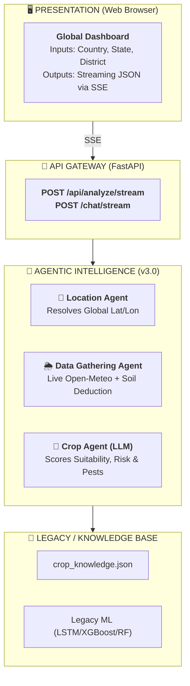

# User Module Paper
## AI Powered Weather Resilient Crop Advisor — v3.0

**Document Type:** User Module Paper  
**Project:** AI Powered Weather Resilient Crop Advisor  
**Version:** 3.0  
**Platform:** Web Application (FastAPI + HTML/JS/SSE)  

---

## Table of Contents
1. [Project Overview](#1-project-overview)
2. [System Architecture](#2-system-architecture)
3. [Core Agentic Workflow (v3.0)](#3-core-agentic-workflow-v30)
4. [AI Explainer & Chat Assistants](#4-ai-explainer--chat-assistants)
5. [Frontend & UI Engine](#5-frontend--ui-engine)
6. [Legacy API Architecture (v2.x / Fallback)](#6-legacy-api-architecture-v2x--fallback)
7. [Data Flow Diagram](#7-data-flow-diagram)
8. [Global API Reference](#8-global-api-reference)
9. [Technology Stack & Platforms](#9-technology-stack--platforms)
10. [System Limitations & Future Scope](#10-system-limitations--future-scope)

---

## 1. Project Overview

The **AI Powered Weather Resilient Crop Advisor** is a state-of-the-art agricultural advisory web application. Moving from an India-only 640-district model (v2.x), version 3.0 scales to a **Global Dashboard** covering 50+ countries. It leverages a multi-agent LLM pipeline, live Open-Meteo data, and dynamic single-shot reasoning to recommend the most suitable crops for a farmer's land anywhere in the world.

### 1.1 Goals

| Goal | Description |
|------|-------------|
| **Global Scale** | Dynamically resolve farm coordinates across 50+ countries. |
| **Agentic AI** | Use Ollama/Gemini Agents to natively reason about crops, risks, and pests without relying solely on static rules. |
| **Real-time Context** | Anchor historical climatology to live Open-Meteo API readings. |
| **Conversational UX** | Provide continuous, context-aware LLM chat for farmers. |

---

## 2. System Architecture

The v3.0 architecture abandons the sequential Python rule-based pipeline in favor of a concurrent **Multi-Agent Intelligence Workflow**.



---

## 3. Core Agentic Workflow (v3.0)

**Location:** `src/agents/`

The core intelligence of the Global Dashboard is orchestrated by a 3-Agent LLM pipeline, completely replacing the legacy ML models for the primary `/api/analyze/stream` workflow.

### 3.1 Location Agent (`location_agent.py`)
- **Purpose:** Resolves dynamic global geographic inputs into exact coordinates.
- **Coverage:** Maps 50+ countries, 250+ states, and 170+ global districts natively via `world_locations.json`.
- **Fallback:** If a rural district is not mapped, gracefully falls back to the state's capital coordinates.

### 3.2 Data Gathering Agent (`data_gathering_agent.py`)
- **Purpose:** Fetches live Open-Meteo weather and deduces local soil/market conditions globally.
- **Weather Fetching:** Pulls 7 days of live temperature and rainfall for the exact lat/lon.
- **Forecast Generation:** Anchors historical climate-zone averages to live temperature to build a fast 6-month forecast.
- **LLM Enrichment:** Prompts the LLM to deduce expected soil textures and market prices based on global geography.

### 3.3 Crop Agent (`crop_agent.py`)
- **Purpose:** Performs dynamic, single-shot crop evaluation.
- **Process:** Filters the `crop_knowledge.json` database using gathered context, passing candidates to the LLM (LLaMA/Gemini).
- **Output:** Natively generates the suitability score, evaluates risk levels, raises pest warnings, and computes planting windows in a single JSON generation task.

---

## 4. AI Explainer & Chat Assistants

### 4.1 LLM Crop Explainer (`llm_explainer.py`)
Generates short, farmer-friendly natural language explanations for the top recommended crops. It details exactly *why* a crop suits the farmer's specific climate and soil, and generates warnings (in multiple languages).

### 4.2 LLM Farmer Chat (`llm_chat.py`)
Powers an interactive, context-aware AI farming Q&A chat. 
- Uses **prompt-based context injection** (farm-specific data is prepended to the LLM prompt).
- Streams tokens via Server-Sent Events (SSE) for a real-time conversational experience.

---

## 5. Frontend & UI Engine

**Location:** `templates/index.html`, `static/js/app.js`

- **Global Inputs:** Country, State, District cascading dropdowns.
- **Dynamic Updates:** Uses SSE `EventSource` to render crop cards, yield badges, risk levels, and explanations instantly as the Agents yield them.
- **Visualizations:** Chart.js powers the year-round temperature and rainfall charts.

---

## 6. Legacy API Architecture (v2.x / Fallback)

> **Note:** The following modules belong to the legacy `POST /recommend` REST pipeline. While they are fully bypassed by the v3.0 Global Agentic UI, they remain in the codebase to support legacy API consumers and provide fallback offline mechanisms.

### 6.1 Crop Recommendation Engine (`src/services/recommender.py`)
Blends rule-based algorithms with ML Random Forest predictions. 

### 6.2 ML Weather Forecasting (`src/ml/lstm_weather.py`)
Provides medium-range forecasts using PyTorch LSTM and XGBoost. Superseded by the Data Gathering Agent's live climate anchoring.

### 6.3 Crop Suitability ML Model (`src/ml/predictor.py`)
A Scikit-learn Random Forest regressor trained on simulated crop conditions. Superseded by the Crop Agent.

### 6.4 Risk Assessment Engine (`src/services/risk.py`)
Rule-based evaluation of drought risk and temperature stress. Now absorbed natively by the LLM Crop Agent.

### 6.5 Pest & Disease Warning System (`src/services/pests.py`)
Rule-based alerts matching weather thresholds. Now generated natively by the LLM.

### 6.6 Planting Calendar (`src/services/calendar.py`)
Rule-based timeline generator for growth phases. Now generated natively by the LLM.

### 6.7 Regional Data & Historical Pipeline
Loaded 640+ specific Indian districts from `regions.json` and 10-year Parquet files. Superseded by the Global Location Agent and live Open-Meteo fetching.

---

## 7. Data Flow Diagram

```
FARMER INPUT (Web Form: Country, State, District, Options)
        │
        ▼
POST /api/analyze/stream
        │
        ├──[1]── Location Agent (location_agent.py)
        │
        ├──[2]── Data Gathering Agent (data_gathering_agent.py)
        │
        ├──[3]── Crop Agent (crop_agent.py)
        │              └── Single-shot LLaMA/Gemini Evaluation
        │
        └──[4]── Stream Output
                       └── Yields JSON chunks via SSE

                               │
                               ▼
                    REAL-TIME STREAMING DASHBOARD
```

---

## 8. Global API Reference

### Global Location Resolution
```http
GET /api/countries
GET /api/states/{country_code}
GET /api/districts/{country_code}/{state_code}
```

### Core Intelligence Engine (v3.0)
```http
POST /api/analyze/stream
Body: { "country": "India", "state": "Maharashtra", "district": "Pune", ... }
Response: SSE streaming JSON chunks of Crop Rankings, Weather, and Explanations.
```

### Farmer Chat Assistant
```http
POST /chat/stream
Body: { "message": "Will it rain tomorrow?", "context": {...} }
Response: SSE stream of LLM tokens acting as an Agronomist.
```

---

## 9. Technology Stack & Platforms

| Category | Technology | Purpose |
|----------|-----------|---------|
| **Backend Framework** | FastAPI (Python) | High-performance async API server |
| **Agentic AI Models** | Ollama (LLaMA 3.2) | Primary local, free, private LLM |
| **AI Fallback Provider** | Google Gemini 2.0 | Fast, high-rate-limit cloud fallback API |
| **Data Orchestration** | Concurrent Futures | Parallel execution of multi-agent LLM requests |
| **Live Data Source** | Open-Meteo API | Real-time & Historical Weather (Free Tier) |
| **Frontend Platform** | HTML5, CSS3, JS | Lightweight, dynamic Single-Page App |
| **Streaming Protocol** | Server-Sent Events | Real-time text generation to the UI |

---

## 10. System Limitations & Future Scope

### 10.1 Current Limitations
| Limitation | Description |
|-----------|-------------|
| **Weather API Dependency** | Requires internet access to Open-Meteo for live data. |
| **Crop Coverage** | Covers 50+ short-duration crops (15–90 days). Staples (sugarcane) not included. |
| **Soil Testing** | Relies on LLM-deduced defaults; no IoT soil sensor integration. |

### 10.2 Future Scope
| Feature | Description |
|---------|-------------|
| **RAG-based Farmer Chat** | Index `crop_knowledge.json` into a vector store (e.g., ChromaDB) for strict grounding. |
| **Market Integration** | Live commodity prices via global agricultural APIs. |
| **Farmer Profile** | Persistent user accounts to track crop cycles over seasons. |

---
*End of User Module Paper — AI Powered Weather Resilient Crop Advisor v3.0*  
*Prepared by Tirth Chankeshwara | HPC Group | CDAC-Pune | June 2026*
